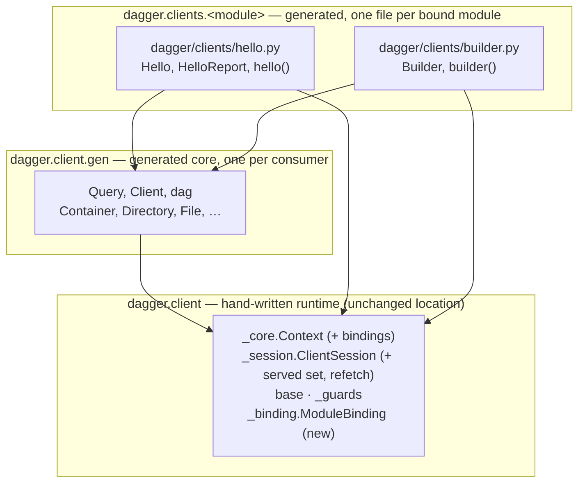
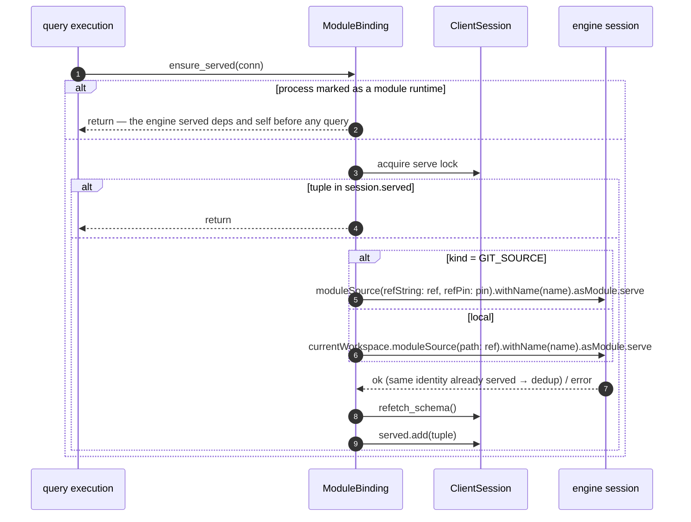
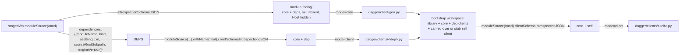

# Modules have clients, not dependencies

author: yves
created: 2026-08-27
status: done (draft PR dagger/python-sdk#22, CI green at 2dc64c7)
related: `github.com/dagger/java-sdk` PR #17
(`hack/designs/done/2026-08-26-modules-have-clients.md`, the source design this
ports); `future/done/self-contained-python-sdk.md` (the layout this builds on);
`github.com/dagger/go-sdk` `go-sdk.dang` (`generateClient` shape)

Every engine claim below was re-verified against `dagger/dagger`
`v1.0.0-beta.11` (`a4e1e4ff`) — by reading the source and, where it decides
the design, by probing a live beta.11 engine from inside a Python module. Line
numbers are beta.11's.

## Problem

A module's dependency and a standalone generated client are the same thing,
built twice — and in Python, only one of the two is built at all.

When a Python module calls a dependency today it calls typed bindings against
a served module: `dag.hello().greet("x")`. That is a client. The only thing a
standalone client — a script, an app, a test — would add is *how the session
and the target module are obtained*: inside a module the engine has served the
dependency into the session before the function runs; outside, the process
opens its own session and has to serve the target itself.

This SDK does not model that. `Mod.generate` reads the module-facing
`ModuleSource.introspectionSchemaJSON` — core plus every dependency, merged —
and renders one flat `sdk/src/dagger/client/gen.py` (`mod.dang:79`,
`vendoredDir`). Three consequences:

1. **There is no client artifact.** Nothing this SDK produces can be handed to
   a Python project that is not a Dagger module. The library has full session
   provisioning (`dagger.connection()`, `sdk/src/dagger/provisioning/`), but
   the bindings it ships are the engine's core API only; a module's functions
   are reachable solely from inside another module.
2. **Dependency bindings are unattributed.** `Hello` and `Container` land in
   the same generated file, indistinguishable. Regenerating for a different
   dependency set silently changes what `gen.py` means, and nothing in the
   output records which module contributed what.
3. **The generator has one mode.** `codegen.generator.generate` renders every
   type in the schema it is given and hard-codes `class Client(Query)` plus the
   `dag` singleton at the end. There is no seam at which a second output could
   be emitted.

Meanwhile the engine already draws the line this design needs.
`ModuleSource.clientSchemaIntrospectionJSON` is the *client-facing* schema
(`core/schema/modulesource.go:3934`, `clientSchemaIntrospectionJSONFile`): it
starts from the core-only schema builder and, when the module has a runtime
SDK, installs exactly that one module, namespaced, never as an entrypoint, and
hides no core types. Its own comment is the specification:

> only the bound module is installed, as a normal namespaced module, so a
> generated client reaches its functions via `dag.<moduleName>` and never
> through a promoted Query root. The module's own dependencies are deliberately
> excluded -- a client is generated for a single module plus core, not for its
> whole dependency graph. Unlike the module-facing schema, it hides no core
> types.

The Go SDK consumes it (`go-sdk.dang`, `generateClient`); this SDK does not.

## Decisions

The java-sdk design settled nine questions (D1–D9). Each is re-examined here:
the engine-level ones are re-verified on beta.11 and kept; the Java-specific
ones are redesigned for Python or dropped when Python does not have the
problem. One (the serve preamble, P3) deviates from the Java design on
evidence, and says so.

**P1 — a client is deps-excluded (leaf-shaped) — engine fact, kept (D1).**
A dependency-authored type never crosses between two clients; core types do,
because they are literally the same Python class (`dagger.Container`). This
costs nothing because the engine forbids the alternative: `Module.validateTypeDef`
rejects a module whose API exposes a dependency-authored type in an object
field (`core/module.go:1362`, "cannot reference external type"), a function
return (`:1395`, "cannot return external type") or a function argument
(`:1412`). A capability that cannot exist cannot be lost. Confirmed
empirically too: the client schema of a probe module has exactly one owned
type and one owned `Query` field, and none of the dependency's types.

**P2 — the hand-written runtime stays where it is; generated clients get a
package of their own — replaces D2.** Java moved its runtime out of
`io.dagger.client` because generated clients were going *into* that package.
Python never needs that: the runtime lives in `dagger.client` (`_core`,
`_session`, `base`, `gen`) and generated clients go into a new, purely
generated subpackage, **`dagger.clients`**, one module file per bound module:
`dagger/clients/hello.py`. Nothing hand-written lives under `dagger.clients`,
so a module name can never collide with runtime code, and no file moves. The
one-letter difference between `dagger.client` and `dagger.clients` is accepted:
`dagger.client` is the transport a generated file imports from and
`dagger.clients` is what user code imports from, and the two never appear on
the same line. A module named `client` or `clients` is fine
(`dagger/clients/client.py`). Names are normalized and checked for collisions;
see *Naming*.

**P3 — the entry point is a module-level function; the serve rides on the
query context; inside a module runtime the serve is a no-op — replaces D3
and deviates from the Java serve preamble.** Java needed a static factory plus
an alias because it has no free functions. Python has them:

```python
from dagger.clients.hello import hello

await hello().greet("x")                 # global client, like `dag`
await hello(client=my_client).greet("x")  # an explicit client
```

`hello(...)` takes the module's constructor arguments and returns the
lazily-built `Hello` object; it does *not* serve. The Python query builder is
lazy — `dag.container()` executes nothing until an `await` — so the serve is
attached to the query context and runs at execution time, once per session per
binding. That keeps the natural chaining idiom and keeps the entry point
synchronous.

The deviation: **inside a module runtime the preamble does not serve at
all.** The Java design serves unconditionally everywhere and relies on the
engine deduplicating. Review of this design found that to be wrong for a
module consumed from git: a module client inherits its *caller's* workspace
(`engine/server/session_workspaces.go:210`, `inheritWorkspaceBinding`), so a
self client or local-dependency client that bakes `/path/in/the/authoring/workspace`
would resolve that path against the consumer's workspace and fail — and the
engine rewrites a git module's local dependencies into git sources
(`core/modulesource.go:2049-2077`), so no baked local identity can be right
there. What makes the no-op correct rather than a shortcut is an engine
guarantee, not a schema probe: a module's session is constructed with the
module's dependencies and the module itself already served, before any query
runs (`engine/server/session.go:936-938`: `client.servedMods =
client.mod.Self().Deps...; ...Append(core.NewUserMod(client.mod))`). A module
only ever vendors clients for its declared dependencies and for itself, so
there is nothing a client could serve in that session that the engine has not.
The no-op asks the schema nothing and chooses nothing; it defers to the
engine's own dependency resolution — the same resolution that produced the
client — which is why it does not reopen the wrong-module risk a `__type`
probe has.

The signal is **a process-local flag the Python runtime entrypoint sets**:
`dagger.mod.cli.app` — what `runtime.py` runs, under both this repository's
runtime and the engine-baked one (the two `runtime.py` files are identical) —
marks the process as a module runtime in `main`, before it connects, and the
preamble reads the flag at call time. It is not an environment variable:
`DAGGER_MODULE`, the obvious candidate, is a user-facing CLI selector
(`internal/cmd/dagger/module.go:168`) that CI setups export, and a standalone
client run under it would silently never serve. A module process has exactly
one session to consider — a module vendors no `dagger.provisioning`, so it
cannot open another — which is why a process-level flag and a session-level
flag are the same thing there.

Outside a module runtime — a script under `dagger run`, an application that
provisions its own session — the preamble serves **unconditionally**, with no
`__type` probe, and caches the served tuple per session. See *The serve
preamble*. The generated bytes carry data only; the branch is in hand-written
runtime, exactly as `SharedConnection` already branches on
`DAGGER_SESSION_PORT`.

**P4 — both entry points, mirroring the Go SDK — engine fact, kept (D4).**
`generateClient(ws, module, path)`, `generateAllClient(ws)` and
`initClient(ws, path, module)`. The engine dispatches `initClient` with
`{path, module}` plus any SDK args (`core/sdk/module_init.go:41`), records the
client in `[modules.<sdk>.as-sdk.clients]` with `{path, module, pin}`
(`core/schema/workspace_client.go:95`), and hands the list back through
`currentModule.asSDK(workspace:).clients` as `{path, module, pin, moduleSource}`
(`core/schema/module_as_sdk.go:89`, `core/current_module_as_sdk.go:104`). The
pinned go-sdk snapshot (`902440e`) predates that API — it reads
`ws.sdk(name:).clients.{{name, source}}` and declares an unused `dev:` argument
the engine never passes — so this design follows beta.11's API, not the
snapshot. Clients are **not** cwd-filtered by the engine (only `modules` are,
`module_as_sdk.go:78` vs `:81-95`); the rollup filters by path containment
itself, as go-sdk does.

One thing is not mirrored: go-sdk registers two `@generate` hooks. The engine
runs a workspace's generators **concurrently** (`core/generators.go:165-178`,
`GeneratorGroup.Run`), so a client rollup could read a local module's client
schema while the module rollup is still producing that module's generated
files. This SDK keeps **one** `@generate` hook, `generateAll`, which generates
the managed modules and then the registered clients on top of the
module-generated state, and returns one changeset. `generateAllClient` stays
a public function for direct use. Independently of ordering, client generation
for a local module this SDK manages stages that module first (P9), so it is
never read ungenerated.

`generateAll` generates the managed modules **at or below the caller's cwd**
only. The engine's cwd policy for `asSDK.modules` also returns the nearest
*enclosing* module when the cwd sits inside one, but a changeset that reaches
outside the cwd is rejected by the engine (`core/schema/workspace.go:2047`,
"changes fall outside the current directory"), so that entry could never be
applied from a rollup anyway — and `dagger api client init` runs every
generator of the SDK scoped to the **client's** path
(`core/schema/workspace_builders.go:495-516`, `withScopedGeneration`), which,
for a client inside a registered module, would otherwise fail on the enclosing
module. Scoped that way, a client init generates exactly the new client.

**P5 — a module generates a client for itself, and that is how it calls
itself — kept (D5).** Self calls go through `dagger.clients.<self>` like calls
to any dependency; a module that cannot reach itself through the engine cannot
benefit from function-level caching on its own calls. Reading a module's own
`clientSchemaIntrospectionJSON` installs the module, which means the engine
builds it — and for a fresh `init` + `generate` there is no `sdk/` yet. The
circularity is broken by **bootstrapping through a staged workspace**, as the
Java design does; Python differs in what "build" means — the runtime installs
the vendored `sdk/` and imports the module's package — and therefore in what
pass 1 must carry so that import succeeds. See *The bootstrap* below.

Verified live: from inside a module function on beta.11, serving the module
itself by workspace path returns success, and `currentWorkspace` resolves
(cwd `/`).

**P6 — no visibility change is needed — drops D6.** Java had to make its
query transport public because a class cannot implement a non-public interface
across packages. Python has no compile-time visibility: the generated client
imports `dagger.client._core.Arg`, `dagger.client.base.Type` and the new
`dagger.client._binding.ModuleBinding` exactly as `gen.py` imports its runtime
today. Nothing changes.

**P7 — core lives in `dagger.client.gen`, generated per consumer, never
coupled to a bound module — kept (D7).** `gen.py` becomes core-only:

- a **module** gets its core from its own module-facing
  `introspectionSchemaJSON`, narrowed to symbols with no owning module. That
  schema hides `TypesToIgnoreForModuleIntrospection` (`Host`),
  `TypesHiddenFromModuleSDKs` (`Engine*`) and
  `FieldsToIgnoreForModuleIntrospection` (`Query.currentWorkspace`,
  `Query.engineVolume`, …) (`core/moddeps.go:17-24`, `core/env.go:46`), so
  `dag.host()` in module code stays an `AttributeError`, as it is today.
  Measured on the probe: 118 types, no `Host`, no `currentWorkspace`;
- a **standalone client** gets its core from the bound module's
  `clientSchemaIntrospectionJSON`, which hides nothing (124 types, `Host`,
  `Engine`, `currentWorkspace` all present) — a client is allowed everything
  the CLI is.

Both are "the engine's core, as this consumer is allowed to see it". A
per-module client file refers to core symbols only through a module alias
(`_core.Container`, where `_core` is `dagger.client.gen`), so its bytes are
identical in both contexts even though the core file legitimately differs.

The residual risk is the compatibility view: the engine renders a module's
schema through that module's declared `engineVersion`, and a module declared
below `v1.0.0` gets the legacy per-type ID surface a modern core does not
have. Generation therefore fails early and clearly when a **bound** module's
`engineVersion` has a numeric core below `1.0.0` — the generator's existing
`parse_version` reads `major.minor.patch` and ignores the prerelease, so
`v1.0.0-beta.11` passes and `v0.20.8` fails; an empty or unparsable value
(`latest`, or a legacy `dagger.json` with no field) resolves to the running
engine and is allowed. The check is the code generator's
(`--engine-version`) because Dang has no version comparison; it is not passed
in `core` mode, where the consumer's own view still comes from the schema's
`__schemaVersion` as today.

**P8 — the SDK already opens its own session — drops D8.** Java had removed
that code path; Python never did. `dagger.connection()` /
`dagger.Connection()` honour `DAGGER_SESSION_PORT`/`DAGGER_SESSION_TOKEN`,
otherwise spawn `dagger session` from `_EXPERIMENTAL_DAGGER_CLI_BIN`, a
downloaded CLI matching `dagger._engine._version.CLI_VERSION`, or `dagger` on
`PATH` (`sdk/src/dagger/provisioning/_engine.py`). Two things change in what
gets vendored for a standalone client: `dagger.provisioning` is included (a
module still excludes it), and `_engine/_version.py` is stamped. The committed
file pins `1.0.0-beta.10` and nothing in this repository regenerates it, so an
unstamped client would provision the wrong engine. The stamp is
`Query.version` **normalized to the bare release tag** — `v1.0.0-beta.11+a4e1e4ff`
becomes `1.0.0-beta.11`, leading `v` and build metadata dropped — because the
downloader adds its own `v` and builds
`/dagger/releases/{version}/dagger_v{version}_…` and caches as
`dagger-{version}` (`provisioning/_download.py:125-140,174`). An engine
whose version has no published release yields a stamp nothing can download;
provisioning then falls back to `dagger` on `PATH` with a warning
(`_engine.py`, `fallback_to_local_cli`), which is the existing behaviour for
an unavailable release.

**P9 — the SDK stages its own local dependencies; the engine stages the
ones it cannot — replaces D9's mechanism, keeps its finding.** Re-verified
on beta.11: `Workspace.generators` returns an empty group for a value
workspace (`core/schema/workspace.go:3278`, `isSyntheticWorkspace`), and
`generateLocalDependencies` then **fails** — `validateDependencyGeneratorGroup`
rejects an empty group with `owning SDK %q exposes no generators`
(`core/schema/modulesource.go:3523`). Nor is there a clean way to ask "is this
a value workspace": `Workspace.generators` seen from inside a module client
reports only the calling client's served modules (`workspace.go:3650`,
`currentWorkspacePrimaryModules`), so any predicate built on it measures the
SDK's own presence, and is flipped by `[modules.<sdk>] generate.skip`.

So the split is by **ownership**, not by workspace kind:

- every local dependency **registered to this SDK** — read from the workspace
  re-anchored at the root, `currentModule.asSDK(workspace: ws.withWorkdir(".")).modules`
  (`"."`, not `"/"`: the engine rejects an absolute workdir), because
  `asSDK.modules` is cwd-scoped (`core/schema/module_as_sdk.go:78`)
  and a dependency is usually a sibling — is generated by the SDK itself,
  recursively, and its generated output overlaid onto the staging workspace.
  Overlays, not changesets, because a changeset is cwd-measured and may not
  reach a sibling. A dependency carrying this SDK's skip marker is assumed
  committed, as today;
- the engine's `generateLocalDependencies` is called **only when the module
  has a local dependency registered to another SDK** — read from
  `ws.sdks` and each `ws.sdk(name).modules`, the same registry the engine's
  owner lookup uses. On a host workspace that is what stages a Go module a
  Python module depends on; on a value workspace it errors, which is correct —
  nothing there can generate it — though, because the engine walks the whole
  local closure in parallel (`modulesource.go:3405`), its message may name a
  Python sibling rather than the foreign dependency; accepted, since that
  combination has no supported in-memory path anyway;
- a local dependency **registered to no SDK at all** is assumed committed and
  is neither generated nor handed to the engine — the engine would only warn
  and skip it (`modulesource.go:3468-3476`), and calling it for that would
  drag every Python sibling through the value-workspace failure above.

A graph whose local dependencies are all Python-owned or unregistered
therefore never touches the engine call, and nothing is generated twice; a
graph with a foreign-SDK dependency pays one engine pass that also covers the
Python dependencies, which the engine caches. The SDK recursion carries an
explicit list of the modules on the active path and fails with a clear
message on a cycle; a diamond (`B` and `C` both depending on `D`) generates
`D` twice from identical inputs, which the engine's cache absorbs. The
engine's own `StagedGeneration` marks are internal (`core/workspace.go:154-162`)
and are not relied on. Recursion is new to this repository's Dang — nothing
here or in go-sdk recurses today — so it is the implementation unknown of
patch 5 and gets a spike before the pipeline is built on it.

### Where the Go and TypeScript SDKs actually are

Stated plainly, because it sets expectations for review: the Go SDK has
`generateClient` / `generateAllClient` / `initClient`, and this design copies
that shape. But Go *module* generation still delegates to the engine's merged
module-facing schema (`go-sdk` `mod.dang:generate`), so Go has not unified
dependencies-as-clients. Java is doing it now (PR #17, open). Python is
second, and the first with a dynamic language: no compile step means the
bootstrap needs no compiler, but also that a stale or missing client only
fails at import time.

## Goals

- One generator, two modes, one output shape. `dagger/clients/<m>.py` is
  byte-identical whether it was produced because another module declared `m`
  as a dependency or because someone asked for a standalone client of `m`.
- Core types live in `dagger.client.gen` (re-exported as `dagger.*`), shared by
  every client in the process.
- A module declares a dependency in `dagger-module.toml` exactly as today; the
  SDK generates a *client* for it instead of merging its schema in.
- A real standalone client artifact: a Python project that `pip install`s (or
  `uv add`s) its vendored `sdk/`, imports `dagger.clients.<m>`, and opens its
  own engine session.
- One shared engine session per process across every client (the existing
  `SharedConnection` singleton, or an explicit client passed to the entry
  point).
- One idempotent serve preamble: a no-op where the engine has already served
  everything a module can bind (inside a module runtime), an unconditional
  serve the engine deduplicates everywhere else, cached per session per exact
  tuple, never a schema probe.

## Non-goals (YAGNI)

- **No compatibility shim.** `dag.hello()` goes away for modern modules; there
  is no dual-mode generator and no deprecation window. Breaking changes are in
  scope.
- **No change to legacy `dagger.json` modules.** They keep being generated by
  the engine's builtin Python SDK, with the merged `gen.py` shape they have
  today. Two shapes coexist, by config format, exactly as two runtimes already
  do (`README.md`, "Two runtimes, one name").
- No cross-module type composition between two dependency clients (P1), and
  no client type in a module's own API surface: a module returns its own
  `@object_type`, never `dagger.clients.<m>.M` — the runtime rejects any
  class whose `__module__` starts with `dagger.clients.` at registration,
  before classifying it as object, enum or scalar, with a message that says
  so (`dagger/__init__.py` rewrites `__module__` only for its own re-exports,
  never for client classes, so the prefix is reliable).
- No engine changes. Everything needed exists on `v1.0.0-beta.11`. One engine
  limitation is recorded rather than worked around: see *Local-name
  collisions* under Risks.
- No published `dagger-io` on PyPI; a client vendors what it needs.
- No change to module authoring (`@object_type`, `@function`, `runtime.py`).
  `runtime/` changes by one line (the generated-files check).
- No client for a module that is not a declared dependency of the module it
  is vendored into. Inside a module runtime the preamble relies on the engine
  having served the module's declared dependencies; a copied-in client for
  anything else is unsupported.
- No self-call in the default starter. The starter's constructor takes a
  `Workspace`, which a self call would have to thread through; demonstrating
  the idiom there is not worth a required argument on every new module. The
  README shows it.
- No `dagger run`-free session for local bindings outside a workspace: a local
  binding needs `currentWorkspace`, which needs a workspace. That limit is the
  engine's and is repeated in the generated docstring.

## Approach

### The unification, precisely

A generated client is **generated bindings plus a serve preamble**. The
bindings are the module's types and its entry point. The preamble makes sure
the bound module is served in the session the first time any query built
through that client executes. Inside a module runtime the engine has already
done that for every module the client could bind, so the preamble does
nothing; outside, it serves. The generated bytes are the same either way.

### Package layout



- `dagger.client` is the runtime, where it is today. One module is added:
  `_binding.py`, the serve preamble. `Context` in `_core.py` learns a
  `bindings` tuple; `ClientSession` in `_session.py` learns a served set, a
  lock and `refetch_schema()`; `dagger.mod.cli.main` marks the process as a
  module runtime.
- `dagger.client.gen` stays the core API, still ending in `class Client(Query)`
  and `dag = Client()`, re-exported by `dagger/__init__.py` as today. It is the
  only file whose contents depend on the consumer's schema view alone.
- `dagger.clients` is new: an empty `__init__.py` plus one generated file per
  bound module. **This subtree is exclusively generated** and is swept on every
  generate; that narrows, deliberately, the "a stray file under `sdk/` survives"
  contract `python-sdk#21` chose for the rest of `sdk/`. The runtime's
  `requireGeneratedFiles` learns the package marker in its vendored-library
  branch (the only layout that has one), so a module missing it fails with
  the same "run `dagger generate` and commit" error as a missing `gen.py`;
  and `dagger.mod.cli.load_module` translates a `ModuleNotFoundError` for
  `dagger.clients.<m>` — a self client deleted or never committed — into that
  same actionable error instead of a bare import traceback.

### Naming

A bound module's **final** name (after any dependency alias) is normalized to
a Python identifier the way the generator already normalizes field names
(`format_name`: initialisms grouped, `camel_to_snake`, keywords and reserved
builtins suffixed with `_`): `hello-world` → `hello_world`, `helloWorld` →
`hello_world`, `import` → `import_`. The file is `dagger/clients/<that>.py`;
the entry point is the same identifier. Generation fails loudly when:

- the normalized name is not an identifier, or starts with `__` (so `__init__`
  and friends can never be overwritten);
- two clients of one consumer normalize to the same file (`foo-bar` and
  `foo_bar`, or `HelloWorld` and `hello_world`);
- the module's root type name is a core type name (`container` → `Container`).

Module-owned fields on core types other than `Query` are emitted as
module-level functions named `format_name(parent)_format_name(field)`, always:
a name that depended on which other parents currently carry the same field
would turn adding `File.asHello` next to `Directory.asHello` into a rename of
the exported `as_hello`. Only the entry point, on `Query`, is bare. A function
name that still collides with the entry point or an owned type fails
generation.

A schema argument that would shadow a name the entry point's body uses
(`client`, `_ctx`, `_args`, `_core`, `_BINDING`) is suffixed with `_`, exactly
as keywords are today (`from` → `from_`), and its `Arg(...)` keeps the GraphQL
name. Two arguments of one entry point that normalize to the same Python name
(`client` and `client_`) fail generation with a message naming both, rather
than emitting a signature Python would reject.

### Type attribution: `@sourceMap` is the partition

The introspection JSON says which module contributed each type and field: the
engine emits `@sourceMap(module: "<name>", filename:, line:, column:, url:)`
(`dagql/server.go:412`) on both. Core symbols carry no `module`.
`codegen.ast.insert_stubs` already parses every directive into the graphql-core
AST for object, interface, input and enum types, and `parse_const_value`
unquotes the JSON-quoted argument; it is extended to scalars so a module-owned
scalar attributes correctly, and the partition fails loudly on a type kind it
cannot attribute (unions — none exist in the engine schema today).

- a type whose owner is empty belongs to core;
- a type whose owner is `M` belongs to `dagger.clients.<m>`, **with all its
  fields** — `id` on an owned type carries no `@sourceMap` (probe: `Probe.id`
  has no directives) and must stay, since `Type.id()`, implicit ID resolution
  and `execute_object_list` depend on it;
- a **field** on an **unowned** type whose owner is `M` (`Query.hello`) belongs
  to `M`.

Verified on the probe's client schema: one owned type (`Probe`), its five
owned fields plus `id`, and `Query.probe`. The root type is read off the
schema — the return type of the `Query` field owned by the module — never
derived by capitalizing the name (`e2e` → `E2E`, not `E2e`).

Core narrowing (`core` mode) is done on the introspection result before
`build_client_schema`: owned types are dropped, owned fields on unowned types
are dropped, and `possibleTypes` entries naming a dropped type are pruned. An
owned type is referenced only by owned fields or by other owned types (P1),
and an owned object implementing a core interface is reached through
`possibleTypes` only, so the result is closed; `build_client_schema` validates
it and raises on anything dangling. Tested with an owned object implementing a
core interface and with owned input, enum and scalar types.

### Generation modes

`python -m codegen generate` gains `--mode core|client` (default `core`, so the
existing invocation in `mod.dang` keeps producing today's bytes for a schema
with no owned symbols), `--module <final name>`, `--binding <json>` and
`--engine-version <bound module's>`:

| mode | input | emits | into |
|---|---|---|---|
| `core` | any schema, narrowed as above | every core type, `Client`, `dag` — today's `gen.py` shape | `sdk/src/dagger/client/gen.py` |
| `client` | a client schema (core + one module); the full schema is kept so references resolve | the types owned by `--module`, the entry point, functions for owned fields on other core types, `_BINDING` | `sdk/src/dagger/clients/<m>.py` |

In `client` mode a reference to an unowned type renders through the alias
`_core` (`from dagger.client import gen as _core`), and a reference to an owned
type renders bare, quoted as a forward reference where needed, as today. The
qualification is one `Context.type_ref(name)` applied at every site that emits
a type name: parameter and return annotations, `execute(T)` and
`execute_object_list(T)` arguments, the `return T(_ctx)` construction, the
`_<Interface>Client` concrete class for interface returns (reachable as
`_core._FooClient` because `_core` is the module, not its `__all__`), enum
default values, and the `expectedType` ID conversion. `dag` in the entry point
is `_core.dag`. Because `core` mode drops everything owned, the core file is
identical no matter which module's client schema it came from — asserted by a
test.

### The serve preamble

```python
# dagger/clients/hello.py
_BINDING = ModuleBinding(
    name="hello", kind="LOCAL_SOURCE", ref="/.dagger/modules/hello", pin=""
)

def hello(name: str, *, greeting: str = "hi", client: _core.Client | None = None) -> Hello:
    """Client for the `hello` module. ..."""
    _ctx = (_core.dag if client is None else client)._ctx.with_binding(_BINDING)
    _args = [Arg("name", name), Arg("greeting", greeting, "hi")]
    return Hello(_ctx.root_select("hello", _args))
```

`ModuleBinding` is hand-written runtime; the generated file carries data and no
logic. `Context.execute` runs `await binding.ensure_served(conn)` for each
binding on the context before building the request. `select`, `root_select`,
`select_id`, `execute_object_list` and `execute_sync` all derive contexts with
`dataclasses.replace`, so bindings travel with the chain and with objects
loaded back by ID.



State lives on the live `ClientSession` (`_session.py`): the served set, and
an `anyio.Lock` that serializes serve → refetch → mark, so two clients racing
on one session cannot interleave two introspections and cannot mark a tuple
served before its refetch succeeded; a failure propagates and marks nothing.
`SharedConnection.close()` drops the session, so a reconnect starts with
nothing served, as it must.

Why no probe: for a git binding, `Server.serveModule`
(`engine/server/session.go:2143`) looks the name up and, if served, compares
`canonicalModuleReference` and pin (`session_workspaces.go:103`) — same source
succeeds, different source fails with `module %s ... already exists with
different source`. A `__type` probe would skip serving when a *different*
module of the same name was present, binding the caller silently to the wrong
module and suppressing exactly that error. For a **local** binding the engine
cannot detect the conflict on beta.11: a workspace-path source has an empty
`AsString` (probe: `kind: DIR_SOURCE`, `asString: ""`) and
`isSameModuleReference` treats an empty side as "same" (`session.go:2164`),
so a same-name collision keeps whatever was served first. The unconditional
serve is still the right call — it is the engine's decision to make, and a
probe would make it the client's — but the conflict guarantee holds for git
bindings only. Recorded under Risks.

Why the schema refetch: the Python query builder renders through gql's DSL
against the schema the session fetched when it connected. Outside a module
that schema predates the serve and lacks `Query.hello`; after a real serve the
session refetches (`ClientSession.refetch_schema()` →
`AsyncClientSession.fetch_schema()`, which rebuilds `client.schema` in place —
verified against gql 4.0.0 and live on beta.11). Refetching after every real
serve, rather than after inspecting the cached schema, keeps the preamble free
of any schema-presence check; it costs one introspection per binding per
standalone session.

The preamble sends a raw GraphQL document (`gql.gql(...)`), not a DSL query:
`currentWorkspace` is hidden from a module's codegen schema but present in
the live session, and the raw form depends on neither.

**The identity tuple.** The bound module's **final** name (after any
dependency alias) is what gets baked and served under: the engine aliases with
`withName` when it loads dependencies (`core/modulesource.go:2034`), and the
synthesized `@sourceMap` carries `mod.Name()` (`core/module.go:1927-1955`), so
an aliased dependency chains and serves the same name. A local binding bakes
the module's workspace-root-relative path with a leading `/` —
`Workspace.moduleSource` resolves a leading slash against the root and a bare
path against the cwd (`core/schema/workspace.go:2818`), and the cwd is not the
client's to assume. A git binding bakes `asString` and `pin`, which resolve
from anywhere. A workspace-loaded module reports `kind = DIR_SOURCE` with an
empty `asString`; it is normalized to `LOCAL_SOURCE` by path, which also keeps
the bytes identical between a client generated in a value workspace and on the
host.

### Where the schemas and identities come from



Dang reads engine object lists through `{{...}}` record selections, so each
dependency is re-resolved from its identity: a local one as
`stagedWs.moduleSource("/" + sourceRootSubpath).withName(moduleName)`, a git
one as `moduleSource(refString: asString, refPin: pin).withName(moduleName)`.
`withName` is what the engine itself uses to alias, so the client schema comes
out namespaced under the final name.

### The bootstrap

Pass 1 vendors the library, the core and the dependency clients, plus a
`dagger/clients/<self>.py` that lets the module's own code import during the
bootstrap build:

- the **committed** self client when the workspace has one — module code that
  already calls itself keeps importing the symbols it imported before;
- otherwise a **stub**: `__all__ = []` and a module-level `__getattr__` that
  returns, for any name, one placeholder class whose instantiation raises
  `RuntimeError("client for module 'app' is not generated yet: run dagger
  generate")`. A placeholder *class* rather than a function so that a name
  used in an annotation is at least a type, and the error a module author sees
  is the one that names the fix.

The supported model is the Java design's: **generate first, then call.** A
symbol added to the module and imported from its own client in the same edit
is not in the carried-over client, so the bootstrap build fails on that
import; the next `generate` after removing the call produces it. A module
that uses one of its client's types in its *own* API — `-> dagger.clients.app.App`
— is rejected by the runtime at registration ("client types cannot appear in
a module's API; return the module's own object type"), whether against the
stub (whose placeholder class lives in the same `dagger.clients.<self>`
module and is caught by the same prefix rule), a stale client, or a current
one.

### Generation pipeline (a module)

```
Mod.generate:                       # public, no arguments, as documented in the README
  ws.withoutDirectory(mod/sdk/src/dagger/clients).withDirectory(mod, generatedTree(ws, [])).changes(ws)

generatedTree(ws, active: [String!]! = []):   # a module-rooted directory holding sdk/
  1. deps      = moduleSource(/mod).dependencies.{{moduleName, kind, sourceRootSubpath, asString, pin, engineVersion}}
     local     = deps where kind != GIT_SOURCE
     owned     = local ∩ this SDK's registry      (asSDK on ws.withWorkdir("."))
     foreign   = local ∩ another SDK's registry   (ws.sdks, ws.sdk(name).modules)
     # anything else local is unregistered: assumed committed
  2. stagedWs  = if foreign is non-empty: ws.withChanges(moduleSource(/mod).generateLocalDependencies(ws)) else ws
  3. stagedWs  = for dep in owned, not skip-marked:
                   raise if dep in active + [mod]                         # cycle
                   stagedWs.withoutDirectory(dep/sdk).withDirectory(dep, Mod(dep).generatedTree(stagedWs, active + [mod]))
  4. src       = stagedWs.moduleSource(/mod)
  5. core      = codegen --mode core   <- src.introspectionSchemaJSON
     clients   = for each dep: codegen --mode client <- dep client schema, identity, engineVersion
  6. pass1     = library(no provisioning) + core + clients + (committed self client | stub)
  7. bootWs    = stagedWs.withoutDirectory(mod/sdk).withDirectory(mod, {sdk: pass1})
     self      = codegen --mode client <- bootWs.moduleSource(/mod).clientSchemaIntrospectionJSON,
                                           LOCAL_SOURCE "/mod", src.moduleName
  8. final     = pass1 with <self>.py replaced  →  {sdk: final}
```

`generatedTree` is the module-rooted generated tree for either kind of
module: a `dagger-module.toml` module produces steps 4–8; a legacy
`dagger.json` module produces the engine's `generatedContextDirectory` exactly
as today — that path is untouched, it works around `dagger/dagger#13947`,
still open on beta.11. Step 7 is the only place the module itself is built.
`Mod.generate` sweeps the generated-clients subtree before merging so a
dropped dependency or a renamed alias is reported as a removal, while the rest
of `sdk/` keeps the merge semantics `python-sdk#21` chose.

Found while implementing, and load-bearing for every overlay above:
`Workspace.withDirectory` merges onto an untouched path but **replaces** the
path once a `withoutDirectory` below it has run (reproduced with a raw query
on beta.11: `withoutDirectory("/m/sdk")` then `withDirectory("/m", {sdk})`
leaves `/m` holding only `sdk/`; without the sweep it merges). Writing only
the generated tree after sweeping the clients subtree would therefore drop the
module's own sources on the second generate of any module with a committed
client. So every write goes through one helper, `Codegen.overlay`, that
composes the full directory first — the existing contents, the swept subtree
removed, the generated tree layered on — and writes that in one go, which is
right under either semantics. A `dagger/dagger` issue is the follow-up.

### What a module's tree looks like

```
<module>/sdk/pyproject.toml, LICENSE, README.md
<module>/sdk/src/dagger/**                     runtime (vendored, unchanged)
<module>/sdk/src/dagger/client/gen.py          core API, module view (no Host)
<module>/sdk/src/dagger/clients/__init__.py
<module>/sdk/src/dagger/clients/<self>.py      the module's own client (P5)
<module>/sdk/src/dagger/clients/<dep>.py       one per declared dependency, final name
```

Module code changes from `dag.dep().fn()` to:

```python
from dagger.clients.dep import dep
from dagger.clients.app import app       # self

    return await dep().greet("x")
    return await app().greet("y")        # a self call, through the engine
```

### What a standalone client looks like

`generateClient(ws, module, path)`:

```
<path>/pyproject.toml                          seeded by initClient when absent, then the user's
<path>/sdk/pyproject.toml, LICENSE, README.md
<path>/sdk/src/dagger/**                       runtime, including dagger.provisioning
<path>/sdk/src/dagger/_engine/_version.py      CLI_VERSION stamped from the engine
<path>/sdk/src/dagger/client/gen.py            core API, client view (Host present)
<path>/sdk/src/dagger/clients/<mod>.py         the bound module's client
```

`sdk/src/dagger/clients/<mod>.py` is byte-identical to the file a module
depending on `<mod>` receives. Stated precisely: identical **for a fixed
binding tuple** — final name, kind, ref or workspace-root path, pin,
compatibility view, schema bytes, generator revision. The same module bound
locally and from git is not identical and should not be. What the claim rules
out is the *context* mattering, and that is what is tested.

A local bound module this SDK manages is staged first, exactly as a dependency
is in P9, so a client is never generated against an ungenerated module; a git
or foreign-SDK module is read as is. Writing mirrors step 9:
`<path>/sdk/src/dagger/clients` is swept, the rest of `<path>` is merged onto
whatever the user has there, so a `main.py` next to `sdk/` survives every run.

`initClient` seeds `<path>/pyproject.toml` from `client-template/`, rendered
by the existing `render-template` helper (project name = the directory's
basename), declaring `dagger-io` with `[tool.uv.sources] dagger-io = { path =
"sdk", editable = true }` — the same shape a module's `pyproject.toml` has, so
`uv sync` in the client directory just works. Nothing else is written; the
engine creates the directory and registers the client.

`generateAllClient(ws)` regenerates every registered client under the
caller's cwd from `currentModule.asSDK(workspace: ws).clients`, using the
`moduleSource` the engine already resolved (pin applied, local or git).
`generateAll(ws)`, the one `@generate` hook, generates the managed modules,
applies that to the workspace, generates the clients on the result, and
returns the whole difference against the caller's workspace as one changeset.

Usage, outside a module:

```python
import dagger
from dagger.clients.hello import hello

async with dagger.connection():
    print(await hello().greet("world"))
```

## Alternatives considered

**Keep the merged schema; just split `gen.py` into core plus one file per
dependency.** Less work, and it preserves `dag.dep()` via monkeypatching
`Query` at import. Rejected: those files are not clients — they cannot be
generated outside a module, because the module-facing schema exists only for
a module — and import-time monkeypatching is invisible to type checkers.

**Monkeypatch `Query.hello` from the client file so `dag.hello()` keeps
working.** Tempting in Python. Rejected for the same reason the java design
has a static factory: it would make the entry point depend on import order and
on a shared mutable core, and no static analyzer would see it.

**Make the entry point async (`await hello()`) and serve eagerly.** Explicit,
but it breaks the lazy chaining idiom every other binding follows
(`hello().greet("x")` would need two awaits). Attaching the serve to the query
context keeps one idiom.

**Serve unconditionally inside modules too (the Java preamble).** Rejected on
the git-consumed-module evidence in P3. Deriving a portable identity at
runtime (`currentModule.source`) exists for the module itself but not for its
dependencies, so it would fix half the problem; the engine already serves
both halves.

**Detect the module runtime from `DAGGER_MODULE`.** Rejected: it is a CLI
selector users export, so a standalone client under it would silently never
serve. The runtime entrypoint sets the flag instead.

**Put generated clients at the top of the `dagger` package
(`dagger/hello.py`).** Shortest import. Rejected: `dagger/log.py`,
`dagger/mod/`, `dagger/telemetry.py` exist, so a module named `log`, `mod` or
`telemetry` would overwrite runtime code.

**Probe `__type` before serving.** Rejected; see *The serve preamble*.

**Always recurse in the SDK and drop the engine's staging (Java's D9).**
Rejected: on a host workspace it is what stages a local dependency owned by
another SDK. **Always call the engine and also recurse.** Rejected: the engine
call errors on a value workspace, and every Python dependency would be
generated twice. **Branch on `Workspace.generators` being empty.** Rejected:
seen from a module it measures the SDK's own generators, not the engine's
ability to stage, and `generate.skip` flips it silently.

**Two `@generate` hooks like go-sdk.** Rejected: the engine runs generators
concurrently, so the client rollup could race the module rollup on a local
target.

**Serve unconditionally and ignore an "already served" error.** Depends on
matching an engine error string. Rejected.

## Affected components

| Component | Change |
|---|---|
| `sdk/codegen/src/codegen/partition.py` (new) | `@sourceMap` ownership of types and fields; core narrowing of an introspection result; entry field / root-type lookup; client naming |
| `sdk/codegen/src/codegen/ast.py` | directive stubs for scalar types |
| `sdk/codegen/src/codegen/generator.py` | `Context` gains `mode`, `module`, `binding`, owned sets and `type_ref()`; handlers skip unowned symbols in client mode; entry point and core-type functions; `Client`/`dag` only in core mode |
| `sdk/codegen/src/codegen/cli.py` | `--mode`, `--module`, `--binding`, `--engine-version`; `client-name`; `cli-version` (the `_version.py` stamp) |
| `sdk/src/dagger/client/_binding.py` (new) | `ModuleBinding`: module-runtime no-op, unconditional serve, per-session cache; the runtime flag |
| `sdk/src/dagger/client/_session.py` | served set, serve lock, `refetch_schema()` |
| `sdk/src/dagger/client/_core.py` | `Context.bindings`, `with_binding`, serve before execute |
| `sdk/src/dagger/mod/cli.py` | marks the process as a module runtime; reports a missing `dagger.clients.<m>` as the generate-and-commit error |
| `sdk/src/dagger/mod/_converter.py` | rejects a `dagger.clients.*` class in a module's API, before classification |
| `sdk/src/dagger/clients/__init__.py` (new) | package marker, vendored with the library |
| `runtime/main.go` | `requireGeneratedFiles` also requires `sdk/src/dagger/clients/__init__.py` in the vendored layout |
| `mod.dang` | the pipeline above: ownership-split staging with cycle detection, core + dependency clients, bootstrap self client with the stub, stale-client sweep, engine-version floor |
| `client.dang` (new) | shared client generation: identity, schema, naming, library with provisioning and the stamped version, output tree |
| `python-sdk.dang` | `generateClient`, `generateAllClient`, `initClient`; `generateAll` covers clients and only modules at or below the cwd |
| `client-template/pyproject.toml.tmpl` (new) | the seeded client project file |
| `.dagger/modules/e2e` | fixtures `clients/{dep,app,foreign-app}`, a Python-capable runner for the standalone check, the checks below, `sdkTestCheck` running `tests/client`, the runtime fixture's vendored `sdk/` regenerated |
| `README.md` | layout, the client entry points, a migration recipe |

## Testing

Unit, `sdk/tests/codegen` (`uv run pytest tests/codegen`):

- partition: owned types and fields split as expected, including
  `Query.hello` on core and `id` kept on an owned type; core narrowing is
  identical whichever module the schema was bound to and does not mutate its
  input; an owned object implementing a core interface, and owned input, enum
  and scalar types, narrow to a schema `build_client_schema` accepts; the root
  type is read from the schema (`e2e` → `E2E`); a union fails loudly; client
  names normalize and reject.
- client rendering: entry point with the module's constructor arguments,
  keyword-only `client`, an argument named `client` escaped, `client` and
  `client_` together rejected; `_BINDING` for a
  local and a git binding, aliased name; core references as `_core.X`
  including a `_core._FooClient` interface return and `execute(_core.T)`; a
  `list[Hello]` return and a `Hello` argument; a function for an owned field on
  a non-`Query` core type, always qualified by its parent;
  duplicate client names and a root type named after a core type rejected;
  the emitted file compiles and imports against the real `dagger` package;
  the engine-version floor accepts `v1.0.0-beta.11`, `latest` and `""` and
  rejects `v0.20.8`; the `CLI_VERSION` stamp normalizes
  `v1.0.0-beta.11+a4e1e4ff` to `1.0.0-beta.11` and `Downloader(version=…).archive_url`
  is the release URL.
- core rendering: owned symbols absent, `Client` and `dag` present, unchanged
  bytes for a schema with no modules and no flags.

Unit, `sdk/tests/client` (new; `sdkTestCheck` gains it in the same patch):

- `ModuleBinding`: no request at all when the process is marked as a module
  runtime, and a request regardless of `DAGGER_MODULE` when it is not; the
  exact GraphQL document for a local and a git binding; served once per
  session and again on a second session; refetch after every real serve;
  concurrent first uses of one tuple serve once; a failed serve or refetch
  marks nothing and the next use retries.
- `Context.with_binding` survives `select`, `root_select`, `select_id`, and
  `execute` serves before requesting — over a fake session.
- `tests/mod`: a function returning or taking a `dagger.clients.*` object,
  enum, scalar or the bootstrap placeholder is rejected at registration; a
  missing `dagger.clients.<m>` import is reported as the generate-and-commit
  error by `load_module`.

e2e, `@check` functions in `.dagger/modules/e2e`, all real generation in the
engine against `fixtures/clients/dep` and `fixtures/clients/app` (modern
modules on the engine's `python` runtime; `app` declares `dep` twice, once
aliased `greeter`, and its source imports its own client from the start). They
cannot run on this repository's `runtime/` by relative path: the engine cannot
load a Go module through `Workspace.moduleSource` (`Directory.asModuleSource`
fails to load the runtime SDK from a workspace snapshot, on the host as much as
in a value workspace), which is also why the runtime fixture has never been
registered for generation. What the checks exercise is the vendored library,
which is the same under either runtime; `runtimeCallCheck` keeps covering the
Go runtime itself, with its fixture's `sdk/` regenerated through a temporary
`python` runtime:

- `clientsGenerateCheck` — from nothing: `gen.py` without `Host`,
  `clients/dep.py`, `clients/greeter.py`, `clients/app.py` (so the stub
  carried the self import through the bootstrap); the dependency client binds
  `/…/dep` under `dep`, the alias under `greeter`; a core type returned by
  `dep` renders as `_core.Container`; a second generate on the applied result
  is empty; a function added to `app` after the first generate appears in the
  regenerated self client; removing the alias from the config removes
  `greeter.py` (a `removedPaths` entry).
- `clientsRuntimeCheck` — the applied result is loaded through the sdk-sdk
  harness's real CLI (`runInstalled(["call", "-m", …])`) and
  `greet-via-dep` / `greet-via-alias` / `greet-self` return the dependency's
  and the module's own answers. This is the runtime coverage the Java series
  could not get: it proves the preamble is a correct no-op inside a module and
  that the clients chain the right names.
- `standaloneClientCheck` — `generateClient` for `dep` produces a
  `clients/dep.py` byte-identical to the one `app` vendors (compared as file
  contents), a core with `Host`, provisioning, and `CLI_VERSION` equal to the
  normalized engine version; a client for `github.com/dagger/sdk-sdk` at its
  pinned commit bakes a `GIT_SOURCE` binding with that pin; `initClient`
  seeds only `pyproject.toml`; the registered-client rollup materializes a
  client and is empty on a second run.
- `standaloneRuntimeCheck` — a script using a client bound to
  `github.com/dagger/sdk-sdk` by ref and pin runs under `uv run` in a
  Python-capable runner and calls the module. Under nesting the only session
  a process can reach is the check's own (no runner host is exposed, and a
  spawned `dagger session` would try to start an engine), so the script
  attaches to it — the `dagger run` shape — and that session's workspace is
  the outer checkout, where no fixture has committed generated files; a git
  binding resolves regardless, which is what the check pins: the serve by ref
  and pin, the schema refetch, and the call. The local-binding standalone
  flow was verified by hand on the host (a script with
  `dagger.Config(workdir=…)` serving `dep` by workspace path) and is listed
  as untested in CI below. The stamp itself is
  covered by `standaloneClientCheck` (literal equals the normalized engine
  version) and the `Downloader.archive_url` unit test; the download path is
  not exercised end to end.
- `foreignDependencyCheck` — a fixture depending on this repository's Go
  `runtime` module (registered to go-sdk in `dagger.toml`) is handed to the
  engine's staging. Where the engine can stage it — a checkout it can diff,
  as in CI — generation succeeds with a client for the Go module vendored;
  where it cannot (a git worktree, whose `.git` file breaks the engine's
  context diff), it fails loudly rather than silently skipping the
  dependency. The same fixture without the dependency generates either way,
  which pins the dependency as the cause. The fixture is reached with
  `findUp: false` so it stays unregistered and out of `generateAll`.

Regression net that must stay green: every existing e2e check (in particular
`tomlGenerateCheck`, `runtimeCallCheck`, `sdkTestCheck`), and the sdk-sdk
suite — `chain:*` is a Python-only local-dependency graph through a real CLI
on a host workspace (the SDK-recursion branch), `generation:*` and `module:*`
the scaffold-then-generate-then-load contract.

What stays untested, plainly: a standalone client with a **local** binding
serving by workspace path from its own session (verified by hand on the host;
in CI every nested process attaches to the check's session, whose workspace
has no generated fixture); a module consumed from git (needs a published
module; covered by design — no serve inside a module — and by the unit test on
the runtime flag); a foreign-SDK local dependency generating *successfully*
(needs a host workspace with two SDKs installed; the branch is pinned, its
success is the engine's pre-existing mechanism); a baked local ref resolving
*inside* a module (by design it never does — `standaloneRuntimeCheck` is the
only place a baked local ref is resolved); `pip install` of a client (`uv run`
installs the same `pyproject.toml`); the CLI download path end to end.

## Risks

- **Every modern module breaks on its next `dagger generate`.** Intended, no
  shim. The README carries the two-line migration (`from dagger.clients.dep
  import dep`; `dag.dep()` → `dep()`).
- **Bootstrap cost.** Each generate now builds the module once in the engine
  (self client) and each dependency once (its client schema). The build is
  `uv sync` of the vendored library, cached by the engine across unchanged
  inputs. Not measured yet; recorded when the e2e checks run.
- **Local-name collisions are undetectable on beta.11.** Two different local
  modules served under one name in one standalone session bind to whichever
  came first (`isSameModuleReference`, empty `AsString`). Git bindings are
  conflict-checked. A `dagger/dagger` issue is the follow-up, not a
  client-side check.
- **The module-runtime no-op is load-bearing.** It rests on
  `engine/server/session.go:936-938` and on `dagger.mod.cli.main` being every
  Python runtime's entrypoint (`runtime/runtime.py`, and the engine-baked
  runtime's `runtime.py`, both call `dagger.mod.cli.app`). Pinned by
  `clientsRuntimeCheck` and a unit test.
- **Generate first, then call.** A self-client symbol imported in the same
  edit that adds it fails the bootstrap build; the error names the import.
- **Local bindings need a workspace.** A client with a local binding used
  outside any workspace fails at `currentWorkspace`. Documented in the
  generated docstring; git bindings resolve anywhere.
- **The schema refetch is a second introspection round trip** per real serve
  in a standalone session. Bounded by the tuple cache; absent inside modules.
- **`dagger.client` / `dagger.clients`** differ by one letter. Accepted (P2).
- **Bound modules below `1.0.0` are rejected** rather than served through a
  legacy view. Loud and early.
- **Legacy `dagger.json` modules keep the old shape.** Two idioms coexist by
  config format until legacy modules are gone; nothing here changes them.
- **A mixed-SDK dependency graph generates its Python dependencies twice**
  (once by the engine, once by the SDK); the engine's cache absorbs it.

# Implementation plan

StGit series on `python-unified-clients-lead-afe256c1`, based on `main` @
`71c445f`. Every patch carries `Signed-off-by: Yves Brissaud <yves@dagger.io>`
and no AI attribution. Each patch leaves the tree green for what it touches:
the runtime seam lands before any generated code references it, the generator
learns its modes while `mod.dang` still drives it in the default (core) mode,
and the cutover in `mod.dang` is one patch because a module cannot
half-generate.

1. **`future: modules have clients, not dependencies`** — this document.
2. **`codegen: attribute schema symbols to their module`** — `ast.py` scalar
   stubs; `partition.py`: `owner_of`, `ownership`, `narrow_to_core`,
   `entry_field` / `root_type_for`, `client_module_name`. Tests including
   `Query.e2E` → `E2E`, `id` on an owned type, the interface/input/enum/scalar
   narrowing cases, a union.
3. **`sdk: serve a bound module before its first query`** — `_binding.py`
   with the runtime flag set by `dagger.mod.cli.main`, `ClientSession.served`
   / lock / `refetch_schema()`, `Context.bindings` / `with_binding`,
   serve-before-execute; the `_converter` rejection and the `load_module`
   translation; `dagger/clients/__init__.py`; `tests/client`, and
   `sdkTestCheck` running it. Nothing generated references any of it yet.
4. **`codegen: render core and per-module client modes`** — `Context`
   modes, `type_ref` at every emission site, handler filtering, `_BINDING`,
   the entry point and core-type functions, naming rules, CLI flags, the
   `cli-version` stamp. Default mode `core` produces today's bytes for a
   module-free schema (pinned).
5. **`python-sdk: generate a client for every dependency and for the module
   itself`** — `mod.dang` pipeline: ownership-split staging with cycle
   detection (spiked first: the first recursive Dang field in this
   repository), core + dependency clients, bootstrap self client with the
   stub, stale-client sweep, engine-version floor; `client.dang` shared
   pieces.
6. **`python-sdk: standalone clients`** — `generateClient`,
   `generateAllClient`, `initClient`, `generateAll` covering clients,
   `client-template/`, provisioning and the stamped version in the vendored
   library.
7. **`e2e: dependency clients, self clients and standalone clients`** —
   fixtures, the Python-capable runner, the five checks, and — together,
   because the second needs the first — `runtime/main.go` requiring the
   clients package marker and the runtime fixture's `sdk/` regenerated.
8. **`docs: clients, entry points and the migration recipe`** — README.

### Verification

- `cd sdk && uv run --frozen pytest -q tests/codegen tests/mod tests/client`,
  `uv run --frozen ruff check`.
- `dagger check` for every e2e check, and the sdk-sdk suite.
- `dagger generate` on the scratch workspace used for the probe: a fresh
  module generates from nothing, a second run is empty, a self call added
  after the first run is picked up by the next.

## Progress

- **Phase 0 — orientation: done.** Repository `dagger/python-sdk`
  (`upstream`), fork `origin` = `eunomie/python-sdk`, base `main` @ `71c445f`
  (upstream and origin agree). Worktree
  `…/python-unified-clients-lead-afe256c1-6e9e5050`, branch
  `python-unified-clients-lead-afe256c1`. Design home `future/`, archive
  `future/done/`. VCS: StGit. Host: GitHub. CI: Dagger Cloud checks
  (`dagger check`, no `.github/`). Provenance: `Signed-off-by: Yves Brissaud
  <yves@dagger.io>`, no AI attribution. Local: dagger CLI `v1.0.0-beta.11`,
  `uv`, Python 3.14; Go only in containers. `dagger/dagger#13947` still open.
- **Phase 1/2 — feature doc and plan: this document.** Engine claims
  re-verified on beta.11 by source and by a live probe module (serve-by-path
  inside a module, `currentWorkspace` inside a module, the real client and
  module schema partitions).
- **Phase 3 — adversarial plan review, round 1: 40 findings from a Codex
  skeptic and a Claude design reviewer, folded in.** The ones that changed
  the design: `asSDK.modules` is cwd-scoped (registry now read from a
  root-anchored workspace); `generateLocalDependencies` errors, not no-ops,
  on a value workspace; baked local paths cannot work for a module consumed
  from git (P3 became a module-runtime no-op, on the engine's served-set
  guarantee); the first generate of a self-calling module needs a bootstrap
  stub; `ClientSession` has no `fetch_schema` (added `refetch_schema`, state
  and lock moved onto the session); `id` on owned types is unowned;
  construction sites and `_FooClient` need the `_core` alias; the standalone
  client would provision beta.10; scalars need directive stubs; shim,
  file-name and argument collisions get explicit rules; the patch order puts
  the runtime seam first.
- **Round 2: 36 of 40 confirmed resolved; 13 new findings, folded in.** The
  ones that changed the design again: `DAGGER_MODULE` is a CLI selector, not
  a runtime marker (the runtime entrypoint now sets a process flag);
  `Query.version` is `v…+build` (normalized before stamping, and the
  standalone runtime check no longer seeds the cache); a `Workspace.generators`
  predicate measures the wrong thing from inside a module (P9 now splits by
  dependency ownership, with explicit cycle detection); go-sdk's two
  `@generate` hooks race under the engine's concurrent rollup (one hook,
  modules then clients, and client generation stages its local target); the
  stub returns a placeholder class and the runtime rejects client types in a
  module's API; reserved names extended; the runtime's generated-files check
  covers the clients package; the default-starter self-call was dropped.
- **Phase 4 — implementation: patches 1–8 landed as an StGit series.** Every
  piece was run against a live beta.11 engine before its patch was cut: the
  `app` fixture generates from nothing with `dep`, `greeter` and its own
  client; `greet-via-dep`, `greet-via-alias` and `greet-self` answer at
  runtime through the generated clients; the standalone `dep` client is
  byte-identical to the vendored one and runs from a plain Python process;
  `dagger api client init` registers, seeds and generates a client; a second
  generate is empty; the six pre-existing generate/init/template checks stay
  green; core mode is byte-identical to the previous generator on the real
  module-facing schema. Two things the plan did not know: the Go runtime
  cannot be loaded through `Workspace.moduleSource`, so the clients fixtures
  run on the engine's `python` runtime; and `Workspace.withoutDirectory`
  followed by `withDirectory` on an ancestor replaces rather than merges, so
  every overlay composes the full directory first (`Codegen.overlay`). The
  Dang recursion (`Mod.generatedTreeIn`) works as written; `self` is a
  reserved name in Dang, and octal literals are not a thing.
- **Phase 5 — code review and fix: done, one round.** A Claude reviewer
  (approve with changes, 14 findings) and a Codex reviewer (reject pending
  fixes, 5 findings) on the implemented diff; every finding was curated into
  one brief and applied by a fixer into the owning patches: reserved-name
  collisions in a client file and a root type named after a core type are
  rejected loudly; a local module ref is decided by the workspace (a config
  file at the path) rather than by string shape, so a dotted directory is no
  longer taken for a git ref; the foreign-dependency check carries a
  counterfactual so its failure is attributable; duplicate client names are
  rejected by the code generator and tested; the `load_module` translation
  covers the bare `dagger.clients` package; the scalar directive stubs leave
  graphql-core's shared scalars alone; bindings are pinned through
  `execute_object_list` and `execute_sync`; an owned enum argument on a core
  field is pinned; `initClient` at the workspace root names the project after
  the module; plus the nits. The full `dagger check` also caught a regression
  the reviewers did not: `generateAll` applied the modules' cwd-relative
  changeset with `withChanges`, which reads root-relative paths, and broke
  `dagger module init` through the sdk-sdk harness — the modules' output is
  now overlaid directly. Two pre-existing issues surfaced and are left alone:
  `initModule` renders `src/probe_2/` for a module named `probe2`
  (`strcase.ToSnake`) while `pyproject.toml` names `probe2`, so a name with a
  digit cannot build; and the `sdk-sdk:contract:*` checks fail in this
  environment on `main` itself (`.dagger/lock` is a version-1 lock the local
  engine refuses to parse) — bisected with `stg pop -a`, so not this series'.
  Unit suite: 261 tests.
- **Phases 6–8 — draft PR, CI, archive: done.** Draft PR
  https://github.com/dagger/python-sdk/pull/22 on `eunomie:python-unified-clients-lead-afe256c1`,
  base `main` @ `71c445f`. Two CI fix rounds: `foreignDependencyCheck` had
  encoded a git-worktree-only failure (in a real checkout the engine stages
  the Go dependency and the module generates with a client for it — the
  check now asserts that contract in both environments); and the one-line
  `runtime/main.go` edit shifted the source-map line numbers embedded in the
  committed `runtime/dagger.gen.go`, which `go-sdk:generate` guards
  (regenerated). CI green at `2dc64c7`: 56 checks, including the five new
  e2e checks, the sdk-sdk chain/contract suites, and `go-sdk:generate`.
  Follow-ups, not in this series: a `dagger/dagger` issue for
  `withoutDirectory` turning a later `withDirectory` on an ancestor into a
  replace; one for the undetectable same-name collision of two local
  bindings; the `initModule` template rendering `src/probe_2/` for a module
  named `probe2`.
- **Round 3 (the cap): the design reviewer passes; the skeptic still fails
  on one blocker and five majors, every one of which is folded in above:**
  "foreign" now means registered to *another* SDK, so an unregistered
  dependency never drags Python siblings through the engine call; the
  `_converter` rejection runs before classification and covers the
  placeholder; the runtime change moves into the e2e patch with the fixture
  it needs; escaped argument names that collide fail generation; a missing
  self client import is translated into the actionable error; a
  foreign-dependency check pins that branch. From the design reviewer:
  `generateAll` filters modules to the cwd (client init would otherwise fail
  under a registered module), the standalone runtime check is made
  deterministic, the runtime check is scoped to the vendored layout, and the
  Dang recursion is flagged as the spike. With every finding adopted and the
  cap reached, the plan proceeds to implementation on the lead's call; the
  dissent is recorded here rather than resolved by a fourth round.

- **Post-landing review: six findings, folded into their owning patches.**
  - Correctness (generated code), major: a description or deprecation reason
    carrying `\` or `"""` rendered a client Python cannot parse, and a
    deprecation reason with a newline broke its one-line literal. `doc()`
    escapes both, the deprecation message escapes backslash first, then the
    quote, then the newlines; tested from the client renderer. Patch
    `codegen-modes`.
  - API stability, major: a function on a core type was qualified by its
    parent only when two parents shared the field name, so adding a field
    elsewhere renamed an exported one. Every non-`Query` function is now
    parent-qualified. Patch `codegen-modes`, with the rule in the README.
  - Correctness (paths), major: `generateClient` and `initClient` only
    normalized their `path`, so `../x` was canonicalized by the engine into a
    root-level directory the caller never named. One `workspacePath` helper
    rejects any `..` segment, and `initModule` uses it instead of its own
    inline check. Patch `python-sdk-standalone`, with an e2e assertion in
    `e2e-clients`.
  - Correctness (templates), minor: the client's `pyproject.toml` took the
    directory basename verbatim as its distribution name. It takes
    `ModulePackage` now, and the template helper accepts only a package name
    PEP 508 and TOML both take — which also protects `initModule`. Patch
    `python-sdk-standalone`.
  - Simplicity, minor: `stagedDependencies` staged an aliased dependency
    twice; the local dependency paths are deduplicated. Patch
    `python-sdk-clients`.
  - Docs, minor: the migration recipe only covered `dag.<dependency>()`. It
    covers a module-owned function on a core type too. Patches
    `docs-clients` and `future-archive`.

  Re-review of those fixes, five more findings, folded into the same patches:

  - Correctness (generated code), major: `textwrap.wrap` is applied to the
    complete docstring literal, and its default `break_long_words` splits a
    long word anywhere — including inside an escape pair or the closing
    delimiter. `wrap` breaks on whitespace only now, which glues every
    delimiter and escape to its word. Patch `codegen-modes`.
  - Correctness (generated code), major: a NUL made the client unimportable,
    a carriage return was rewritten as a newline, and a trailing quote got a
    space appended instead of round-tripping. `doc()` escapes `\r` and
    `\x00`, and escapes a trailing quote instead of padding it; the
    deprecation message escapes `\x00` too. Patch `codegen-modes`.
  - Correctness (paths), major: the engine reads `\` as a separator
    (`pathutil.SandboxedRelativePath`), so `..\escape` walked straight past
    the `..` check. `workspacePath` converts backslashes to slashes first.
    Patch `python-sdk-standalone`, with the e2e assertion extended in
    `e2e-clients`.
  - Correctness (templates), minor: the template helper's guard was a
    blacklist, and `strcase.ToSnake` keeps `@` and newlines, so `foo@bar`
    rendered a project `uv lock` rejects. One positive rule on the derived
    name instead. Patch `python-sdk-standalone`.
  - Docs, minor: this ledger. Patch `future-archive`.

  Follow-ups, not in this series, both for the next refresh of the committed
  `sdk/src/dagger/client/gen.py` (not regenerated here): `Directory.withPatch`
  carries an unescaped `\n` in its docstring, rendered before the escaping
  fix; and a core description ending in a quote will render as `\"` where it
  is `" ` today.
