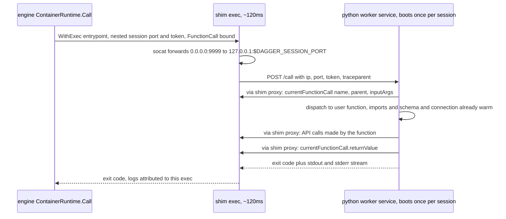

# Python modules: ideas for making them blazing fast

Status: ideation — a ranked pick list, not a plan
Date: 2026-08-25
Scope: both runtimes — `dagger/dagger`'s `sdk/python/runtime` (what actually
executes today) and this repository's `runtime/` (PR #17, not yet routed to) —
plus the code generator and the client library both of them vendor into modules.

## TL;DR

A warm `dagger api call` on a module scaffolded from this repo's `default`
template costs **~4.4s** on this machine. About **3.1s** of it is three fresh
Python interpreter boots of ~1.05s each, and **~0.85s of every boot is Python
doing nothing the function asked for**: importing 1,028 modules (of which
beartype decoration of 851 generated methods, an OpenTelemetry SDK that never
emits a span on the happy path, and a GraphQL client that re-downloads and
rebuilds the schema the generated client was generated *from*), recompiling the
vendored SDK to bytecode because the previous exec's `.pyc` files were thrown
away, and first-touching ~1,000 files on a fresh mount.

Ranked by (payoff × confidence) / lift:

| # | Idea | Where | Per warm call | Lift | Validated |
|---|------|-------|--------------:|------|-----------|
| 1 | Take `Workspace` out of the default template's constructor | templates (this repo; Go SDK has the same) | **0s as written** — see below | trivial | measured, then **retracted** |
| 2 | Warm worker: run the module as a session service, dispatch calls through a ~120ms shim exec — **no engine change** | runtime (both) + client library | **−0.9s per boot** (3 boots → ~0.4s total) | large | networking proven in-engine; dispatch protocol not built |
| 3 | Lean boot: no beartype at import, no OTel SDK on the happy path, no schema fetch/rebuild, persisted bytecode, no `provisioning` | client library + codegen + runtime | **−0.3s measured, −0.5s projected per boot** | medium | −300ms/boot measured in-engine |
| 4 | Codegen emits a schema-free query builder (drop `gql`+`graphql-core` at runtime) | codegen + client library | −0.1..−0.15s per boot | medium | components measured, not assembled |
| 5 | Dang runtime instead of a Go runtime module | this repo's `runtime/` | −0.3s | medium | span evidence; java-sdk precedent |
| 6 | Stop installing the user's package; install only its third-party deps, keyed on `pyproject.toml`+`uv.lock` | runtime (both) | −1.0s per source edit | small | mechanism validated on host |
| 7 | Prebuilt runtime base image with SDK deps preinstalled and precompiled | runtime (both) | cold-start; offline installs | medium | speculative |
| 8 | Codegen container: lose `--isolated`, lose alpine, lose the per-module strip exec | `mod.dang` | `dagger generate` ~2s → ~0.5s per module | small | generator itself measured at 0.2s |
| 9 | Engine: service-backed `ModuleRuntime`, constructor+function fusion, per-exec first-touch cost | dagger/dagger | as #2, natively | large | observations, for upstream |

Compounding, on the default template: 4.4s → ~2.4s (#3) → ~1.5s (#2 or #9)
→ ~1.2s (#5). With an engine-side getModDef cache on top, the warm floor is
the CLI's own ~1.0s. Idea #1 is not in that chain: it was implemented,
measured against a real user test, and retracted — see its section.

## Method

Everything below was measured on this host against the running
`registry.dagger.io/engine:v1.0.0-beta.10` (CLI v1.0.0-beta.10), plus a host
venv of `sdk/` (Python 3.14.7) for import-time work. The host is shared and
noisy (±0.3s on wall clock); every in-engine number is reported per run, and
per-boot phase numbers come from instrumentation *inside* the module container,
which is far less noisy than wall clock.

Workspace under test: `/tmp/ws`, this checkout vendored at `sdk/python-sdk`
with `[modules.python-sdk.as-sdk] name = "python"`, and `dagger module init
python app` from the `default` template. That yields the exact combination new
users get today: **this repository's code generator** (a `dagger-module.toml`
module is generated by `Mod.generate`'s `vendoredDir`) running on **the engine
builtin runtime's trusted path** (`[runtime] source = "python"`, no codegen at
load, `uv pip install -e ./sdk -e .` because the template ships no `uv.lock`).

Because the trusted path installs whatever is committed under the module's
`sdk/`, **every client-library change below was A/B'd in the real engine by
editing the module's committed `sdk/` and calling again** — no engine or
runtime rebuild needed. That is also the recommended way to spike any of the
library ideas further.

Calls use fresh arguments (`--base-image-address img$N echo --msg m$N`) so no
run hits the persisted function cache, giving the worst case: three boots
(`getModDef`, constructor, function) per call.

### Baseline: where a warm call goes

Four warm calls, default template, three boots each:

| run | `load workspace` | constructor `app` | `App.echo` | wall |
|---|---|---|---|---|
| 1 | 1.4s | 1.0s | 1.0s | 4.38s |
| 2 | 1.3s | 1.0s | 1.0s | 4.25s |
| 3 | 1.4s | 1.2s | 1.0s | 4.45s |
| 4 | 1.5s | 1.0s | 1.0s | 4.50s |

`load workspace` decomposes (from a `-vv` tree) into `PythonSdk.moduleRuntime`
0.3s → `asModule getModDef` 1.0s (a Python boot), plus `load SDK: python` 0.2s
(twice) and `load module: python-sdk` 0.1s, partially overlapped. The ~0.8s
between the spans and the wall clock is CLI process start, `connect` (0.2s)
and session teardown.

### Anatomy of one boot (measured inside the container)

Instrumented `sdk/src/dagger/__init__.py`, `mod/cli.py` and `mod/_module.py`
(process age from `/proc/self/stat`, `perf_counter` marks between phases),
reported through the function's own return value. Function boot, four runs:

| phase | ms |
|---|---:|
| interpreter start → first `import dagger` | 10–20 |
| `from dagger.mod.cli import app` (whole import chain) | **665–684** |
| `telemetry.initialize()` | 57–60 |
| `anyio.run` startup | 2 |
| `dagger.connect()` (gql session, introspection query, schema build) | 60–67 |
| `load_module()` (entry point + user module import) | 3 |
| first API round trip (`currentFunctionCall.parentName`) | 3 |
| dispatch + the function itself + return value | 14–17 |
| **total since exec start** | **820–850** |

The engine's span for the same exec is 1.0–1.1s, so **~150–250ms is outside
Python** (container setup, nested session, mounts, result publish, teardown).
For scale, a trivial `alpine` exec costs 71–77ms, 102–108ms with
`experimentalPrivilegedNesting`, and `python -c pass` inside
`python:3.14-slim` is 10ms.

The import chain is the lever. The same import is **354ms on the host** and
**390–440ms steady-state inside the container** (a second interpreter in the
same exec, measured via `subprocess`). The fresh-exec number is ~300ms worse
because:

- the vendored SDK is installed editable (`uv pip install -e ./sdk`), so its
  `__pycache__` is written into the exec's throwaway mount and **recompiled on
  every boot**: `compileall` of `sdk/` measured at 96–114ms in-container
  (51ms on host). `UV_COMPILE_BYTECODE=1` cannot help an editable install —
  there is nothing in site-packages to compile.
- the rest (~200ms) is first-touch of ~1,000 module files on a fresh snapshot
  mount. This is the same mechanism that could not be isolated behind
  `use-uv=false`: it is per-exec, per-file overhead, so it scales with the
  number of files imported, not with CPU.

Host `-X importtime`, cumulative, the parts that matter (of 1,028 modules):

| import | ms (host) | why it is there |
|---|---:|---|
| `dagger.client.gen` | 178 | **146ms self, of which ~141ms is `@typecheck` (beartype) wrapping 851 methods** — the class bodies themselves cost 5ms |
| `gql` + `graphql` | 57 | DSL query builder, schema fetch |
| `dagger.telemetry` (OTel SDK) | 43 | + 29–60ms at `initialize()` importing `requests`, `urllib3`, `charset_normalizer`, `certifi`, protobuf: **183 modules** |
| `beartype.door` | 26 | `TypeHint` checks in `_core`/`_converter` |
| `asyncio` + `anyio` | 33 | needed |
| `httpx` | 17 | needed (or stdlib) |
| `cattrs` | 14 | needed |
| `dagger.provisioning` | 87 cumulative, **15 net** | engine download/CLI code; dead in modules; this repo's vendoring already drops it, the builtin's does not |
| `exceptiongroup` backport | 15 | stdlib on 3.11+ |

For comparison, `anyio + httpx + cattrs + json` alone is **~71ms wall and 276
modules** (host, three runs: 70.4–71.9ms) against 372–384ms and 1,072 modules
for the full SDK; `anyio` is the floor — swapping `httpx` for stdlib
`http.client` saves nothing (77–94ms, 199 modules).

### What the SDK does with the schema, and why it does not need to

`sdk/src/dagger/client/_session.py` builds the gql `Client` with
`fetch_schema_from_transport=True`; `_core.py` then builds every query through
`gql.dsl.DSLSchema(schema)`. So every boot runs the full introspection query
(engine round trip 26–29ms, 397KB), `json.loads` (3ms), `build_client_schema`
(7ms) and `DSLSchema()` (21ms), and carries `graphql-core` (45ms import) —
**to obtain, at runtime, exactly the schema `gen.py` was generated from**. The
generated client knows every type, field and argument; the runtime schema is
redundant with it. The Go and TypeScript SDKs' query builders are plain string
builders for this reason.

## The ideas

Each: what, mechanism, impact, effort, risk, validation status.

### 1. Take `Workspace` out of the default template's constructor — retracted

**What was proposed.** `templates/default`'s `create(cls, ws: dagger.Workspace,
...)` makes the module constructor a Workspace-arg function. A Workspace is
session state, so such a constructor is never a cache hit in a later CLI
invocation: it re-runs, with a full Python boot. Moving the Workspace to the
function that reads it should make the constructor cacheable.

**Why it was retracted.** It moves which call is cacheable; it does not remove
a boot. The default template has one function, and that function is the one
that needs the workspace, so:

- constructor takes the Workspace: the function caches, the constructor runs;
- function takes the Workspace: the constructor caches, the function runs.

One uncached call either way. Confirmed on a real user run (engine trace
`cc3f4067…`, two full lifecycles on one machine): the repeated call is
`MyModule.container CACHED` with the old template and `Query.myModule CACHED`
with the new one, measuring 2.51s and 2.48s.

**Why the first measurement disagreed.** It passed a fresh constructor argument
on every call (`--base-image-address img$RANDOM`), which forces the constructor
to re-run and makes the old template pay two boots to the new template's one.
That is not how the template is normally called. The −1.0s figure was real for
that call shape and not representative.

**What would actually help**, if the template is revisited: give the function a
`Directory` argument with `DefaultPath` instead of a `Workspace`. A Directory
is addressed by content, so both the constructor and the function cache, and a
true repeat call costs no boot at all — verified in-engine (`App.container
CACHED`). Whether that is acceptable is a 1.0 design question, since both this
SDK and `dagger/go-sdk` moved their templates to `Workspace` deliberately.

**Status.** Implemented, measured, reverted. The template is unchanged.

### 2. Warm worker: the module as a session service, with a shim exec per call

**What.** Today `core/sdk.go`'s `ContainerRuntime.Call` does a fresh
`WithExec` of the runtime container for every function call and for
`getModDef`. Instead, the SDK's `moduleRuntime` returns a container that is a
**tiny shim** bound to a **long-lived Python worker service** (the exact
runtime container of today, with entrypoint `runtime.py --serve`). The engine
still execs the shim per call — ~120ms — but the interpreter, imports, schema
and connection live once per session in the worker.

**Why it needs no engine change — proven.** The obstacle is that API calls must
be made *as* the shim's nested client (so `currentFunctionCall` and
`returnValue` resolve to that exec). The shim can hand its session proxy to the
worker: it runs `socat TCP-LISTEN:9999,fork TCP:127.0.0.1:$DAGGER_SESSION_PORT`,
and sends its IP, that port, `DAGGER_SESSION_TOKEN` and `TRACEPARENT` to the
worker over the service network. Spiked in-engine with raw GraphQL: a
`python:3.14-slim` service bound as `worker` to an `alpine` exec with
`experimentalPrivilegedNesting`; the worker dialed back through the shim and
ran `{version}`: `status=200 body={"data":{"version":"v1.0.0-beta.10..."}}
rtt_ms=9.0`. Execs and session services are mutually routable; the session
proxy is just a TCP listener in the exec's netns.

Per-call floor with a prebuilt shim image (apk layer cached), five runs:
**119–133ms** end to end (service binding + nesting + socat + curl + the
worker's round trip through the shim to the engine). Plain nested exec: 102–108.

**Design sketch.**



What has to change in the client library: `SharedConnection` is a process
singleton; per-call connection params (and `TRACEPARENT`) become a
`contextvars.ContextVar` so concurrent calls in one worker each use their own
shim proxy; `dag` stays a module global. `runtime.py --serve` is an asyncio
HTTP server that runs one task per call (blocking sync functions go to a
thread, as `asyncify` already does). Logs: the worker streams the call's
stdout/stderr back in the response; the shim replays them so the engine
attributes them to the right span. Failure: a worker crash fails the call and
the service restarts on the next binding.

What is *not* affected: function-result caching (dagql keys on the call
recipe, not on how it was executed), secrets/sockets (API calls), the
`FunctionCall` protocol. `getModDef` becomes a ~30ms request too. State leakage
between calls in one process is the real semantic change; the function cache
already assumes purity across sessions, but a documented opt-out (`cache =
"never"` → fresh worker, or a per-function `isolated=True`) is cheap to add.

**Impact.** Boots go from ~1.05s to ~0.15s. On the default template: 4.4s →
~1.7s; on a Workspace-free module: 3.5s → ~1.4s. Every call in a `dagger
check` session after the first pays ~0.15s per boot instead of ~1.05s.
**Effort.** Large (client library refactor + worker server + shim; a week or
two to spike end to end). **Risk.** Process-state leakage semantics, log
attribution fidelity, `experimentalPrivilegedNesting` on the shim (already the
case for runtime containers), engine service lifecycle (a session that never
calls the module never starts the worker — good). Shim size: replace
`alpine + apk` with a static `socat`-class binary. **Validated**: the hard
part (networking/attribution) in-engine; the dispatch protocol not built.

Idea 9a is the same architecture done natively in the engine; this one is the
bridge that ships without waiting for it, and the proof that it works.

### 3. Lean boot: stop paying for what the happy path never uses

Five independent cuts to the client library, each with a mechanism, measured
in-engine by editing the module's committed `sdk/` (four runs per variant,
per-boot totals from in-container instrumentation):

| variant | import ms | telemetry ms | connect ms | boot total ms |
|---|---:|---:|---:|---:|
| baseline | 665–684 | 57–60 | 60–67 | **820–850** |
| a. no beartype decoration at import | 516–542 | 50–68 | 67–70 | 660–710 |
| b. no OTel SDK (stub + manual `traceparent` header) | 574–597 | 0 | 67–68 | 680–700 |
| c. schema from a committed constant instead of introspection | 672–719 | 57–77 | 27–30 | 810–860 |
| a + b | 422–520 | 0 | 64–69 | **520–590** |
| a + b + c | 423–453 | 0 | 33–62 | 510–600 |

**a. Beartype.** 141ms of every boot is beartype compiling wrappers for 851
generated methods that the call will never invoke. An earlier spike measured lazy
per-method decoration (−150ms, semantics preserved); the rolled-back
`sdk-python-lean-module-boot.patch` skipped it in modules outright. The new
option, which needs neither runtime magic nor a behavior change: **have the
code generator emit the checks**. It knows every parameter's type; a generated
`if not isinstance(args, list): raise TypeError(...)` per argument costs zero at
import, keeps the `TypeError` UX, and removes the `beartype` dependency from
the runtime entirely (`beartype.door.TypeHint` uses in `_core`/`_converter`
are on `Sequence[Type]`/`Optional` checks that `typing.get_origin` covers).

**b. OpenTelemetry.** The engine sets `OTEL_TRACES_EXPORTER=otlp` and
`OTEL_EXPORTER_OTLP_TRACES_PROTOCOL=http/protobuf` on every exec
(`engine/engineutil/executor_spec.go`), so `telemetry.initialize()` imports
the OTLP HTTP exporter and with it `requests` (183 modules, 29ms host / 57ms
container) — and the SDK's **only** tracer use is `record_exception` on the
error path (`mod/_exceptions.py`). The happy path needs exactly one thing from
OTel: the `traceparent` header, which is `os.environ["TRACEPARENT"]`.
Initialize the SDK lazily inside `record_exception` (or replace that one span
with a 20-line OTLP/JSON POST over the httpx client already open); drop
`opentelemetry-sdk`, `-exporter-otlp-proto-http`, `-instrumentation-logging`
and their transitive `requests`/`urllib3`/`protobuf` from the vendored
library. Log correlation (`LoggingInstrumentor`) is only useful if the logs
are exported — they are not; Dagger captures stderr.

**c. Schema.** On its own a wash: a committed 400KB JSON constant costs about
what the 27ms fetch did once `json.loads`+`build_client_schema`+`DSLSchema`
are still paid, and it grows the vendored SDK. The real cut is idea 4 (no
schema object at all). Recorded so nobody re-spikes the half measure.

**d. Bytecode.** ~100ms/boot recompiling the editable SDK. Two fixes: install
the vendored SDK **non-editable** (it is generated, never edited in place) so
`UV_COMPILE_BYTECODE=1` actually compiles it into site-packages; or run
`python -m compileall sdk/src` as a build layer after the source mount. The
first is one flag — but it must be done in the runtime: setting `editable =
false` in the module's `pyproject.toml` alone fails on the builtin's legacy
path with *"Requirements contain conflicting URLs for package dagger-io:
file://.../sdk vs file://.../sdk (editable)"* because `withInstall` hard-codes
`uv pip install -e ./sdk -e .`. `uv sync --no-editable` / dropping the `-e`
for `./sdk` in both runtimes is the change. Validated on host that a
non-editable `uv sync` produces `site-packages/dagger/client/__pycache__/gen.*.pyc`
before any import.

**e. Provisioning.** This repo's `library` filter already excludes
`src/dagger/provisioning/**` (net −15ms; most of its cost is shared with
`httpx`). The builtin's `WithSDK` still vendors it for legacy modules. Not
worth more than the note.

**Impact.** a+b measured −300ms/boot (−35%); with d and idea 4, projected boot
~300–400ms in-container (steady import ~150–200ms, no compile, fewer files to
first-touch). On the default template that is −1.5..−2s per call.
**Effort.** a: codegen change, medium; b: small; d: one flag per runtime.
**Risk.** a changes *where* type errors are raised, not whether; b removes
exception spans from the raw telemetry unless re-implemented; d none.
**Validated** a, b in-engine; d mechanism on host.

### 4. Codegen emits a schema-free query builder

**What.** Replace `gql.dsl` with a string builder in `_core.py`: `Field`
already holds `type_name`, `name`, `args`, `children`, `inline_type`; the
generated `Arg(...)` list carries the GraphQL names and defaults. Serializing
arguments as GraphQL literals (scalars via `json.dumps`, enums by `.name`,
lists/inputs recursively — `cattrs` already unstructures them) gives the same
document the DSL produces, without a `GraphQLSchema`. Transport: `httpx` POST of
`{"query": ...}` with the basic-auth token, which is all `gql`'s httpx
transport does, plus the retry policy (`Retry` in `_config.py`) reimplemented
in ~30 lines or kept via `httpx`'s transport retries.

**Mechanism.** Removes: `gql`, `graphql-core` (57ms import host, ~110 in
container), the per-boot introspection round trip (27ms) and schema build
(28ms), and `client.validate = lambda: None` — the SDK already disables
client-side validation, so no behavior is lost. `graphql.pyutils.snake_to_camel`
(used in `mod/_utils.py`) is a 5-line function.

**Impact** −100..−150ms per boot; smaller vendored SDK (fewer files to
first-touch). **Effort** medium (two files, plus argument literal encoding and
its tests; the DSL output is the oracle). **Risk** literal encoding edge cases
(`JSON` scalar, nested inputs, IDs). **Validated** components measured;
builder not written.

### 5. A Dang runtime for this repository

**What.** `runtime/` is a Go Dagger module. Every call pays `PythonSdk.
moduleRuntime` **0.3s** (a container exec of the compiled Go runtime plus ~8
API round trips in `discovery.go`), and `load SDK: python` 0.2s, on the
critical path before `getModDef`. `dagger/java-sdk`'s runtime is 146 lines of
Dang and evaluates in-engine: `moduleRuntime` costs no exec.

**Mechanism.** Everything `discovery.go` does is expressible in Dang against
the same API: `sourceSubpath`, `digest`, `entries`, `glob`, `file(...).contents`,
and `File.search` for `[tool.dagger]`/`requires-python`/`[tool.uv.sources]`
(the self-contained design flagged pyproject parsing and name normalization as
the risk; `Mod.generate` in `mod.dang` already reads the same TOML shapes, and
`NormalizeProjectName` is three regexes). The uv binary, cache mount,
`UV_*` env, `uv sync --no-dev --locked --no-editable` and the entrypoint are
plain container calls.

**Impact** −0.3s per call (and possibly the 0.2s `load SDK`). **Effort**
medium; the Go code is 1,400 lines but most is plumbing. **Risk** name
normalization parity (pin with the fixture matrix from PR #16's
`initNamingCheck`). **Validated** span evidence only.

### 6. Do not install the user's package at all

**What.** A known option keeps the install layer independent of user source by
installing against a stub. Cheaper: **do not install the module**. With
`PYTHONPATH=<src>/src` and `DAGGER_DEFAULT_PYTHON_PACKAGE=<pkg>` (already set),
`mod/cli.py`'s `get_entry_point` falls back to `find_spec(IMPORT_PKG)` and
loads the module — validated on host, no dist-info needed. Then the only
install layer is `uv sync --no-dev --locked --no-install-project --no-editable`
(host: 57ms) keyed on `pyproject.toml` + `uv.lock` + `sdk/` — inputs that do
not change when the user edits code — and a source edit costs **zero execs**
(today ~1.0s of `uv pip install` + `uv pip check` per edit, from the
warm-up rows above).

**Trade-off.** Modules that configure `[project.entry-points."dagger.mod"]`
keep working only through the env fallback (or by writing a `.pth`/dist-info
stub); `importlib.metadata.version("app")` inside a module stops working. Both
are documentable. Also removes the `ContextDirPath` content-digest hazard
from the install layer, because the install layer no longer mounts
the source.

**Impact** −1.0s per source edit; **Effort** small; **Risk** entry-point users;
**Validated** loading mechanism on host, not in-engine.

### 7. A prebuilt runtime base image

**What.** Every module's install layer installs the same ~40 wheels (SDK deps)
into a fresh `/opt/venv`, from the shared `modpython-uv` cache volume (which
serializes concurrent module builds), and needs PyPI on a cold engine.
Publish `ghcr.io/dagger/python-sdk-runtime:<py>-<sdkversion>` = `python:3.14-slim`
+ uv + the SDK's locked dependency set preinstalled and precompiled. The
install layer then only adds the user's extra deps and the vendored `sdk/`.

**Mechanism.** Layer sharing across modules and across cache prunes; no
network for the common case; fewer first-touch files if the SDK itself is also
in the image (then `sdk/` only needs `gen.py`, and idea 3d's compile goes
away). **Impact** cold first call (today ~1.4s image pull + ~1s install) and
offline capability; small on warm calls. **Effort** medium (release pipeline,
digest pin via the existing `images/*/Dockerfile` Dependabot pattern).
**Risk** version skew between image and vendored SDK — pin the image tag to the
SDK version that generated the module. **Speculative.**

### 8. Make `dagger generate` cheap

**What.** The generator is fast — `python -m codegen generate` on the live
schema is **0.20s on host** for 15.8k lines. `Mod.generate` spends its ~2s
elsewhere: `ghcr.io/astral-sh/uv:python3.14-alpine` (musl; +35% on every
Python import, per the prior doc), `uv run --isolated --frozen --package
codegen` (creates a throwaway venv per invocation), and a separate
`libraryPyproject` container exec per module to strip dev sections.

**Mechanism.** `uv sync --frozen --no-dev --package codegen` as a layer keyed
on the generator's sources and lock, shared by every module, then the generator
runs from that environment. The strip step keeps using the image's own
`python`, so it does not depend on that layer.

**Keep the image on musl.** A first attempt also moved the image to
`uv:python3.14-bookworm-slim`, because musl walks Python imports more slowly.
Measured both ways: the generator run is 0.85–0.94s on glibc against
1.13–2.30s on musl, but the glibc image is 64.3 MiB compressed against
38.8 MiB. On a 4.7 MB/s link that is 12.9s to pull instead of 8.7s — the
25 MiB costs about five times what the faster interpreter saves. Reverted to
alpine; the layer, which is the actual win, is unaffected (0.82s on alpine,
0.85s on glibc).

**Impact** ~1.5s per module per generate (`uv run --isolated` 2.31s → synced
layer 0.85s); **Effort** small; **Risk** none; **Validated** in-engine.

### 9. For dagger/dagger (report upstream, not fixable here)

**a. Service-backed `ModuleRuntime`.** `core/sdk.go` defines `ModuleRuntime`
with `AsContainer()`/`Call()`; `ContainerRuntime` is the only implementation.
A `ServiceRuntime` that starts the SDK's container once per session as a
service and multiplexes `FunctionCall`s over a connection (call ID in the
nested-client metadata so `CurrentFunctionCall`/`returnValue` resolve per
request, not per exec) is idea 2 without the shim, and generalizes to every
SDK. The SDK contract change is small: `moduleRuntime` returns a container
whose entrypoint serves calls instead of executing one. The engine could even
keep the worker across sessions keyed on the runtime container digest, which
would also retire the `getModDef` boot.

**b. Constructor + function fusion.** When the constructor result is not
cached (idea 1's case), `ModuleFunction.Call` runs two execs back to back with
the second's parent being the first's output. A `FunctionCall` with a
`parentCall` would let the runtime do both in one boot. Cheap for SDKs to
support (the Python dispatcher already has both paths in-process), saves a
boot whenever the parent is uncached, all SDKs.

**c. Per-exec first-touch.** ~200ms of a fresh exec is paying to walk ~1,000
files on a new snapshot mount; the prior doc's `use-uv=false` −200ms is most
likely this (a different install layout, not a faster installer). Worth a look
at the snapshotter (metacopy/`erofs`, or keeping the runtime rootfs's inode
cache warm between execs) since it taxes every SDK's every boot.

**d. Known engine-side wins still stand:** persistent `getModDef` cache keyed on source
digest, skipping `ls-remote` for pinned commits, and the init-time typedefs of
the builtin runtime.

## Dependency audit: what the runtime can stop shipping

| dependency | ms (host import) | needed at runtime? | replacement |
|---|---:|---|---|
| `beartype` | 26 import + 141 decoration | no | codegen-emitted checks; `typing.get_origin` for the three `TypeHint` uses |
| `gql[httpx]`, `graphql-core` | 57 | no | string query builder (idea 4); `snake_to_camel` inline |
| `opentelemetry-sdk`, `-exporter-otlp-proto-http`, `-instrumentation-logging` (+ `requests`, `urllib3`, `charset_normalizer`, `certifi`, `protobuf`) | 43 + 29–60 at init | not on the happy path | env `TRACEPARENT` header; lazy import in `record_exception` or an OTLP/JSON POST |
| `rich`, `platformdirs` | 16, 13 | no (provisioning) | already excluded by this repo's vendoring |
| `exceptiongroup` | 15 | no on 3.11+ | builtin `ExceptionGroup` |
| `typing_extensions` | 10 | mostly no on 3.14 | keep for `Self`/`Doc` on 3.10 targets, or gate |
| `httpx`, `httpcore` | 17 | yes | (stdlib `http.client` measured: no gain, `anyio` is the floor) |
| `anyio` | 14 | yes | — |
| `cattrs` | 14 | yes | — |

A runtime built from `anyio + httpx + cattrs + gen.py` imports in ~75ms on
the host (~5× less than today's 372–384ms wall); in-container, with bytecode
persisted and a quarter of the files to first-touch, the boot projects to
~250–400ms instead of ~850ms.

## Checked and not proposing

- **Lazy per-type generated modules / splitting `gen.py`.** Without beartype
  the whole 16.7k-line module body executes in **5ms**. There is nothing to
  make lazy; do idea 3a instead.
- **Schema from a committed file** (3c): a wash, see above.
- **Interpreter flags.** `python -c pass` is 10ms in `python:3.14-slim`
  (`--enable-optimizations --with-lto`); `-I -S` saves nothing measurable.
- **Alpine / musl base**: +35% on imports (prior doc), confirmed direction by
  the codegen container's choice being the slow one.
- **`editable = false` in the template alone**: breaks on the builtin's
  legacy install path (conflicting URLs); it is a runtime change (3d).
- **`uv pip check`**: 10ms on host; dropping it is free but not a lever.
- **Re-measuring init/generate cold paths**: earlier measurements cover them; the only
  new number is that the Python generator itself is 0.2s (idea 8).

## Suggested order

1. Idea 1 (template) and 3b/3d (OTel off the happy path, non-editable SDK) —
   small, independent, ship in this repo; 3d also lands in `dagger/dagger`'s
   runtime for legacy modules.
2. Idea 3a + 4 together in the code generator (checks and query builder are
   both "the generator knows the types"): this is the codegen direction Yves
   asked for, and it takes the vendored runtime down to `anyio/httpx/cattrs`.
3. Idea 2 spike end to end (shim + `--serve` worker + contextvar connection)
   on this repo's runtime, since it is the one we control. If it holds, it is
   the case for 9a upstream.
4. Idea 5 and 6 in this repo's runtime; 8 in `mod.dang`.

## Addendum (2026-08-31): download size is a first-class cost

Every measurement above this line was taken on a fast fibre connection, which
systematically under-weighted image size. A user run on a slower link
(~4.7 MB/s, engine trace `cc3f4067…`) changed two conclusions.

**Pull time is proportional to compressed image size, and it is not small.**
Measured from that trace, against the registry manifests:

| image | compressed | observed pull |
|---|---:|---:|
| `python:3.14-slim` | 41.4 MiB | 8.4–9.7s |
| `uv:python3.14-alpine` | 38.8 MiB | 7.9–8.7s |
| `uv:python3.14-bookworm-slim` | 64.3 MiB | 12.9–15.4s |
| `uv:0.11.16` (binary only) | 23.9 MiB | 4.9–5.3s |

So an idea that saves a second of compute but adds 25 MiB of download is a
loss for anyone not on fibre. Idea 8's image switch was exactly that, and is
reverted.

**The Dang runtime pulls one image the engine builtin does not.** It fetches
`uv` from `ghcr.io/astral-sh/uv:0.11.16` (23.9 MiB, ~5.3s), where the builtin
gets `uv` from `dist/uv` inside the engine image the user already has. Even
paying that, the cold call measured 24.25s against the builtin's 36.23s, so
the runtime rewrite is worth about 17s and gives 12s back.

Two ways to remove the remaining 5.3s, neither taken:

- Commit the `uv` binary. It is 23.4 MiB gzipped against this repository's
  1.35 MiB of history — 18× larger, paid by every clone, and again on every
  version bump since binaries do not delta-compress. Rejected.
- Drop `uv` for `pip`, which is already in `python:3.14-slim` and free. `pip`
  installs the module in 4.13–16.95s against `uv`'s 0.54–2.84s, and an install
  runs on every code edit. Rejected: it trades a one-time 5.3s for several
  seconds on every iteration.

That leaves idea 7 (a published runtime base image) as the only real fix, and
its gain is one round trip rather than fewer bytes.

## Addendum (2026-08-27): measured after implementing 1, 3a, 3d, 4, 5, 8

Ideas 1, 3a, 3d, 4, 5 and 8 are implemented on this branch (one patch each).
Three scratch workspaces were compared on `v1.0.0-beta.11`:

- **A** — `upstream/main` before this series: old library, engine-builtin Go
  runtime, default template with the Workspace constructor.
- **A′** — same stack, Workspace-free module (isolates idea 1).
- **B** — this series: new library and generator, Dang runtime by relative
  ref, new default template.

Every module has the same `echo(msg)` function, called with a fresh argument
each time so nothing hits the function cache.

### Warm calls (shared engine, everything cached), wall clock

| | A | A′ | B |
|---|---|---|---|
| per call | 4.25–4.50s | 3.36–3.71s | **2.65s** (×4 identical) |
| function boot span | 1.0–1.1s | 1.0s | **0.7–0.8s** |
| inside Python, per boot | 820–850ms | — | **590–620ms** |

### Cold calls (throwaway engine + fresh volume per run, three runs each)

| | A | A′ | B |
|---|---|---|---|
| first call, cold | 20.3, 21.8, 23.1s | 19.1, 21.6, 21.9s | **9.3, 9.5, 13.8s** |
| second call, same engine | 4.6, 4.7, 5.5s | 3.5, 3.5, 4.7s | **2.6, 2.9, 3.1s** |
| call after a source edit | 5.7, 5.9, 6.0s | 5.7, 6.0, 11.6s | **4.2, 4.2, 4.4s** |

Where the cold `load module` goes (one verbose run each):

| | A (18.8s) | B (6.4s) |
|---|---:|---:|
| load the SDK runtime module | **13.7s** — `go SDK: load runtime`: a `go build`/codegen of the engine-builtin runtime module (`withExec` 9.6s, `loadPackage` 3.7s) | **0.4s** — Dang, evaluated in-engine |
| build the module runtime container | 4.0s — pull `python:3.14-slim` 2.5s, install | 5.3s — pull uv image 0.9s + rootfs 1.0s, pull `python:3.14-slim` 2.0s, install ~1.6s |

The Dang runtime pulls the uv image instead of shipping a bundled binary (the
builtin bundles `dist/uv`), which is the ~1.9s it spends that A does not; idea
7 (a prebuilt runtime base image) would take that and the Python pull out of
the cold path together. Cold runs are network-bound and vary accordingly
(B's 13.8s run, A′'s 11.6s edit run).

The edit-and-call row is where the install-layer finding (keep it independent
of source) still applies: both stacks rebuild the install layer on a source
edit; B's is ~1.5s cheaper because the non-editable install is one exec (no
`uv pip check`) and the boots that follow are shorter.

## Appendix: raw runs and artifacts

- Host venv: `/tmp/sdkbench` (uv sync of `sdk/`, Python 3.14.7).
- Scratch workspace: `/tmp/ws` (module `app` = default template + `echo` +
  two `importbench` helpers; module `bare` = Workspace-free).
- A/B harness: `/tmp/spike/{patch.py,run*.sh}`; pristine `sdk.orig`.
- Warm-worker spike: `/tmp/warmspike/{svc.graphql,shim.tmpl,run.py,floor.py}`
  run under `dagger api with-session`.
- Introspection JSONs: `/tmp/introspection.json` (standard, 1.15MB pretty /
  397KB compact), `/tmp/introspection_codegen.json` (codegen format).

In-container phase lines, baseline, `App.echo` boot, all runs:

```
pre_import=10 import=850 telemetry=60 anyio=2 connect=72 load_module=3 first_query=3 invoke=17 total=1020  (first call after install-layer rebuild)
pre_import=20 import=686 telemetry=60 anyio=2 connect=76 load_module=3 first_query=3 invoke=15 total=860
pre_import=10 import=698 telemetry=56 anyio=2 connect=60 load_module=3 first_query=3 invoke=16 total=850
pre_import=10 import=696 telemetry=57 anyio=2 connect=61 load_module=3 first_query=3 invoke=17 total=850
pre_import=10 import=665 telemetry=57 anyio=2 connect=63 load_module=3 first_query=3 invoke=14 total=820
pre_import=10 import=684 telemetry=58 anyio=2 connect=62 load_module=3 first_query=3 invoke=14 total=840
pre_import=10 import=684 telemetry=58 anyio=2 connect=166 load_module=7 first_query=5 invoke=43 total=970
pre_import=20 import=679 telemetry=60 anyio=2 connect=67 load_module=4 first_query=4 invoke=17 total=850
```

Fresh-exec import split (`importbench-2`, two execs): steady-state
subprocess import 390–440ms; with the SDK's `__pycache__` removed 454–671ms;
`compileall sdk/` 96–114ms. `sys.path` in the runtime:
`['/', ..., '/usr/local/lib/python3.14/site-packages', '/src/xxh3:…/app/src', '/src/xxh3:…/app/sdk/src']`.

Warm-worker floor (`floor.py`): shim exec 1471ms (first: apk layer), then
133, 122, 119, 119ms; plain alpine exec 71, 76, 77ms; with nesting 102, 108,
104ms.

Engine introspection over a live session (`with-session`, `http.client`):
`{version}` 0.5–1.0ms after the first; full introspection 25.9, 28.0, 27.6,
26.1, 28.9ms for 397,413 bytes.
