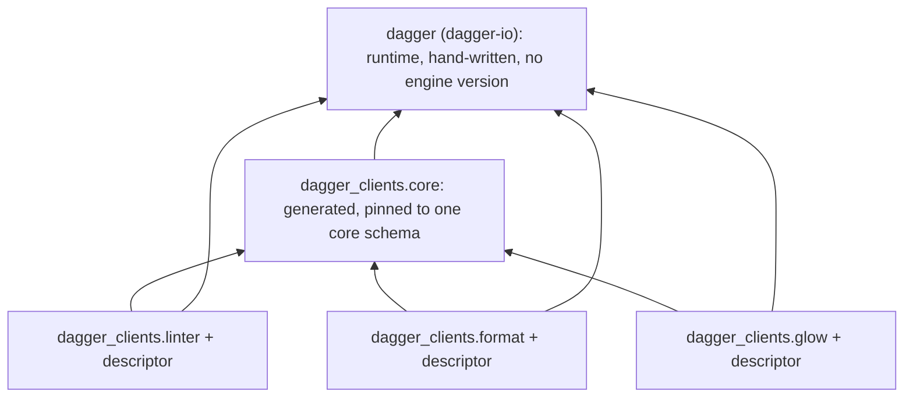
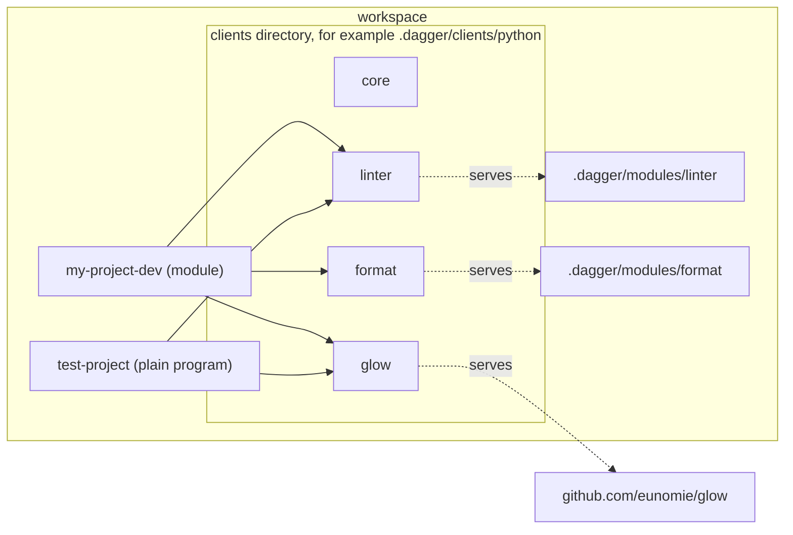
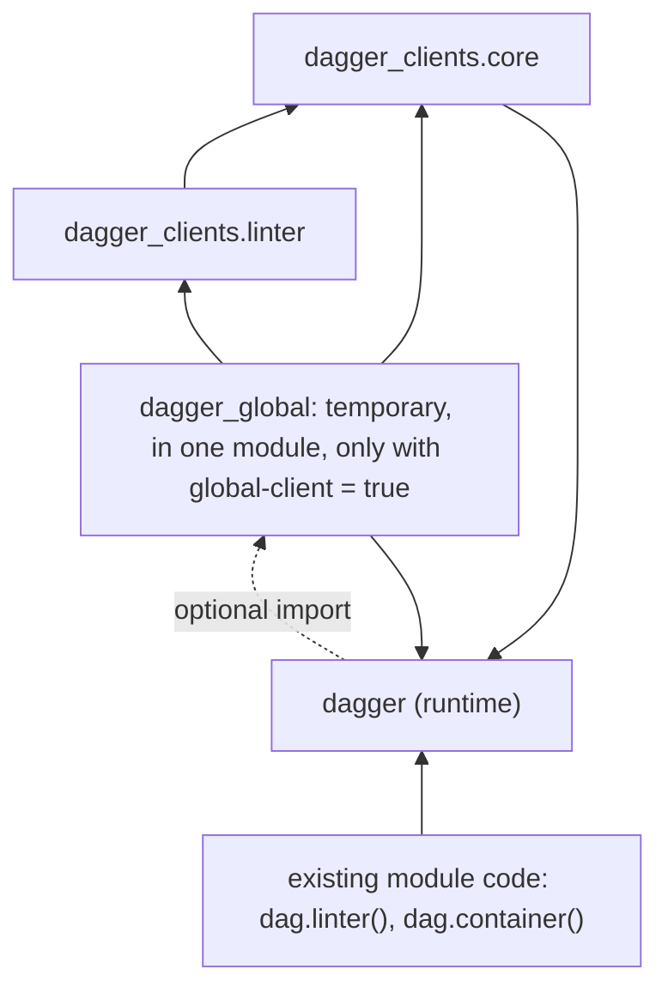

# Unified clients for the Python SDK

Status: proposed, design only (revision 2)
Date: 2026-09-15
Repo base: `290ed4c`
Spec: "Unified clients" (language-neutral). Prior art: `dagger/java-sdk#23`.

This is the markdown copy of the HTML design page. Badges:
**[confident]** checked against code or by experiment.
**[decided]** Yves decided it.
**[provisional]** a design that needs sign-off.
**[speculative]** not verified; a phase 1 spike must confirm it.
**[open]** a product or API decision. Each has a recommendation.

Revision 2, after Yves's first review:

- The clients directory is a convention. `.dagger/clients/python` is a
  suggestion. Clients can go anywhere (5.3, Q12).
- New section: a temporary global client, behind a `pyproject.toml` flag.
  Existing modules keep `dag.linter()`. New modules do not get it (9, Q5).

## 1. Summary

- A client artifact is a small Python project: a directory with a `pyproject.toml`.
- The SDK generates one artifact per client into a clients directory. The
  location is a convention. This document uses `.dagger/clients/python` as the
  example.
- Core is an artifact too, in the same clients directory.
- All generated code lives in one namespace package, `dagger_clients`. The
  runtime keeps the name `dagger`. The two names cannot collide.
- The way into a client is a function in its own package: `linter()`, `core()`.
- `dagger.dag` becomes a hand-written `Session`. It is no longer a generated class.
- Each client package carries its descriptor and serves its module on first
  use, once per session. Nothing at run time depends on where the artifact is.
- A temporary global client keeps existing module code working. A flag in the
  module's `pyproject.toml` turns it on. The SDK sets the flag when it upgrades
  an existing module. A new module has no flag.
- The runtime imports generated core in many places today. Phase 1 must remove
  these imports.
- No hard blocker. `contextModuleSource` does not exist yet. It blocks only one
  case: a local client called from a module. An interim path covers that case.

## 2. Terms

The spec terms apply without change: client, scope, client project, consumer,
core, runtime, serve. Added terms:

| Term | Meaning here |
| --- | --- |
| Distribution | What a package manager installs, for example `dagger-clients-linter`. |
| Import package | What Python code imports, for example `dagger_clients.linter`. |
| Namespace package | An import package without `__init__.py` (PEP 420). Many distributions can each add one sub-package to it. |
| Client artifact | The generated directory for one client: one distribution with one import package. |
| Client package | The import package inside a client artifact: `dagger_clients.<name>`. |
| Clients directory | The directory the SDK writes client artifacts into. It can be any workspace path. |
| Descriptor | The data that tells a client package where its module is: a workspace path, or a git ref and pin. |
| Global client | A temporary generated object, `dag`, with one method per core field and per client. It exists only for migration. |

## 3. What exists today [confident]

The current SDK generates per scope. Each module gets its own copy of everything.

- `mod.dang:138` (`vendoredDir`) copies the whole `dagger-io` library into `<module>/sdk/`.
- `mod.dang:192` (`bindings`) generates one file, `sdk/src/dagger/client/gen.py`.
  It holds core and every client of the module. The input is the module-facing
  schema, `introspectionSchemaJSON`.
- The generator emits `class Client(Query)` and `dag = Client()`
  (`sdk/codegen/src/codegen/generator.py:245-257`).
- Module code reaches a client through core: `dag.client_dep()`.
- `python-sdk.dang:145-147` writes each client as `[[dependencies]]`. The engine
  serves the client. Generated code serves nothing.
- `python-sdk.dang:100-105` refuses clients in a scope without a module.
- `findClientRoot` exists (`python-sdk.dang:42`), with `pyproject.toml` as the marker.
- The runtime build installs `./sdk` (`runtime/build.dang:167-189`).
- Python SDK settings live in `[tool.dagger]` of the module's `pyproject.toml`:
  `use-uv`, `base-image`. `helpers/pyproject/pyproject.go:60-87` reads and
  writes them. `runtime/build.dang:304-313` reads them.
- `sdk/src/dagger/__init__.py:12-13` already has a hook for extra generated
  bindings: `from dagger_gen import *`.
- The committed core bindings (engine `v1.0.0-beta.10`) have
  `ModuleSource.clientSchemaIntrospectionJSON`, `ModuleSource.withName`,
  `Query.moduleSource(refString, refPin)`, `Module.serve(includeDependencies, entrypoint)`,
  `SourceMap.module`. `Query.contextModuleSource` does not exist.
- The generator already parses schema directives (`sdk/codegen/src/codegen/ast.py:93`).

## 4. Target layout [provisional]

An arrow means "imports". The runtime imports no generated code. Section 9 adds
one optional, temporary exception.



The worked example. The clients directory is the suggested one; any other path
works the same way.



Files on disk, in the suggested clients directory:

```
.dagger/clients/python/
  core/
    pyproject.toml            name = "dagger-clients-core"
    src/dagger_clients/       no __init__.py: a namespace package
      core/__init__.py        generated types, core(), CORE_DIGEST
      core/py.typed
  linter/
    pyproject.toml            name = "dagger-clients-linter"
                              dependencies = ["dagger-io", "dagger-clients-core"]
                              [tool.uv.sources] dagger-clients-core = { path = "../core" }
                              [tool.dagger] generated-client = "linter"
    src/dagger_clients/
      linter/__init__.py      generated types, linter(), as_linter()
      linter/_target.py       descriptor and the core digest it was generated against
      linter/py.typed
```

## 5. Packaging

### 5.1 What a client artifact is [confident]

A directory with `pyproject.toml` and `src/`, built with `uv_build`. It builds
into a wheel without an engine. Tested with uv 0.12.13:

- `module-name = "dagger_clients.linter"` builds a wheel with only `dagger_clients/linter/`.
- Two editable path installs share the `dagger_clients` namespace.
- A consumer that names only `dagger-clients-linter` also gets core: uv follows
  the path source in the client's own `pyproject.toml`.
- With `py.typed` per sub-package, mypy and pyright report type errors across
  the namespace.

### 5.2 How a consumer declares a dependency [provisional]

With uv, and the suggested clients directory:

```toml
# test-project/pyproject.toml
[project]
dependencies = ["dagger-io", "dagger-clients-linter", "dagger-clients-glow"]

[tool.uv.sources]
dagger-clients-linter = { path = "../.dagger/clients/python/linter", editable = true }
dagger-clients-glow   = { path = "../.dagger/clients/python/glow",   editable = true }
```

pip ignores `[tool.uv.sources]`, so a pip user installs core explicitly too.

### 5.3 Where artifacts go [decided: convention only]

The clients directory is a convention. `.dagger/clients/python` is a
suggestion. It can become a best practice. Nothing requires it.

- Nothing at run time depends on the location. The descriptor names the
  module, not the artifact.
- The location matters in two places only: where `generateScope` writes, and
  which path a consumer names.
- Two scopes share one artifact only if they write to the same clients
  directory. Two different directories give two copies. That is the user's choice.
- Nothing in the SDK finds a generated artifact by its path. `findClientRoot`
  uses a marker in the artifact's `pyproject.toml` (section 12).
- Core and the clients that use it must be in one clients directory, because a
  client names core by a relative path (`../core`).

How the SDK picks the directory is Q12.

### 5.4 Where the build gets it

- Plain program: the package manager reads the path.
- Module: the runtime build sees only the module context directory.
  `generateScope` adds the clients directory to `include`. [speculative] An
  include above the module root is not verified (Q8).
- Runtime: this repo does not publish `dagger-io` (Q2).

## 6. Namespacing [confident mechanism, open name]

Generated code goes into the top-level namespace package `dagger_clients`. A
client `telemetry` becomes `dagger_clients.telemetry` and cannot collide with
`dagger.telemetry`. Core is `dagger_clients.core`, so a client named `core` is
refused.

`dagger.clients.<name>` is not possible: `dagger` is a regular package, and
type checkers do not follow `pkgutil.extend_path` across installs.

| Input | Rule | Example |
| --- | --- | --- |
| Client name | Lowercase. Replace `-` and `.` with `_`. | `my-project-dev` → `my_project_dev` |
| Refused | Not an identifier, a keyword, starts with `_`, `core`, two clients with the same result. | `class`, `core` |
| Distribution | `dagger-clients-` + name with `-` | `dagger-clients-my-project-dev` |
| Root class | Today's codegen rule | `MyProjectDev` |
| Entry function | Snake-case name | `my_project_dev()` |

## 7. Entry point [provisional]

```python
# A module (consumer)
from dagger import function, object_type
from dagger_clients.core import Directory
from dagger_clients.linter import linter

@object_type
class MyProjectDev:
    @function
    async def lint(self, src: Directory) -> str:
        return await linter().lint(src)
```

```python
# A plain program (consumer)
import anyio
import dagger
from dagger_clients.core import core
from dagger_clients.linter import linter

async def main():
    async with dagger.connection():
        src = core().host().directory(".")
        print(await linter().lint(src))

anyio.run(main)
```

Constructor arguments follow today's rules: required are positional, optional
are keyword-only. The session is an optional keyword-only argument; without it
the function uses `dagger.dag`. A GraphQL argument named `session` becomes
`session_` (Q3).

```python
def linter(source: Directory, *, config: str | None = None,
           session: Session | None = None) -> Linter: ...
```

A field a client contributes to a core type becomes a module-level function
with the core receiver first. The receiver holds its session (Q4).

```python
from dagger_clients.linter import as_linter

lint = as_linter(binding)          # was: binding.as_linter()
```

Two core types that contribute a field with one name get one function with
`@typing.overload` per receiver type.

## 8. Session handle and serve

**`dagger.dag` [confident on shape].** Without the global client, it is an
instance of hand-written `dagger.Session`. The session owns the connection, the
query transport and the serve memo. It has no API fields.

- `dagger.connection()` and `dagger.Connection` yield a `Session`.
- Without the global client, `Session.__getattr__` raises `AttributeError` with
  a migration message that names `core().container()` and the `global-client`
  flag. The runtime does not import core for this.
- Without the global client, a PEP 562 `__getattr__` on `dagger` does the same
  for `dagger.Container` and other core names.

**Serve [provisional].** Serve is async and `linter()` is sync, so serve runs at
execute time.

1. The runtime `Context` gets the set of descriptors the query needs.
2. `linter()` creates a `Context` that needs the linter descriptor.
3. Chained selections keep the set.
4. `Context.execute` asks the session to serve each descriptor first.
5. The session serves each descriptor at most once, with one `anyio.Lock` per
   entry. Two sessions each serve.
6. An object passed as an argument becomes an ID through its own `execute`,
   which serves its own descriptor.
7. The module runtime loads arguments from IDs in `dagger/mod/_converter.py:62`.
   The generated class carries its descriptor for this.

```python
# dagger_clients/linter/_target.py (generated)
from dagger.client import Target

TARGET = Target.local(name="linter", path="/.dagger/modules/linter")
# or: Target.git(name="glow", ref="github.com/eunomie/glow", pin="4f1c9e…")
CORE_DIGEST = "sha256:…"
```

The `path` is the workspace path of the module. It does not depend on the
clients directory.

| Descriptor | Client session | Module session |
| --- | --- | --- |
| git | `moduleSource(refString, refPin)` | `moduleSource(refString, refPin)` |
| local, today | `currentWorkspace.moduleSource(path)` | No serve; `[[dependencies]]` (interim, Q7) |
| local, after the engine change | `contextModuleSource(path)` | `contextModuleSource(path)` |

## 9. Temporary global client [decided goal, provisional shape]

### The goal

Existing module code must keep working without a change to the user's code.
That code uses `dag.linter().lint()`, `dag.container()` and `dagger.Container`.
A global client gives it these names during migration. A newly initialized
module does not get the global client.

### The flag

```toml
# <module>/pyproject.toml
[tool.dagger]
global-client = true
```

- The flag is in the same table as `use-uv` and `base-image`. The SDK already
  reads and writes that table.
- No flag means no global client.
- Existing module: `generateScope` writes `global-client = true` once, when it
  upgrades a module to the new layout. It detects an existing module: the
  module had a config before generation (`python-sdk.dang:108`) and has legacy
  bindings at `sdk/src/dagger/client/gen.py`.
- New module: the templates do not contain the flag.
- After migration: `dagger call python-sdk mod config set --global-client=false`
  removes the flag. The next `dagger generate` removes the global client.
  `config get` reports the flag.
- Only generation reads the flag. The runtime does not read `pyproject.toml`.

### What the SDK generates

With the flag, `generateScope` generates one more module, `dagger_global`,
inside the module scope. It is the only generated code that belongs to one
consumer, because it lists that module's own clients. The unified client
artifacts do not change.

```python
# dagger_global/__init__.py (generated, temporary)
from dagger import Session
from dagger_clients.core import *                  # dagger.Container keeps working
from dagger_clients.core import core
from dagger_clients.linter import Linter, linter   # and every type of each client

class Client(Session):
    def container(self, *, platform=None) -> Container:
        return core(session=self).container(platform=platform)

    def linter(self, source: Directory) -> Linter:
        return linter(source, session=self)

dag = Client()
```

- Same classes: `dag.container()` returns `dagger_clients.core.Container`. Old
  and new calls can mix in one module.
- Contributed fields: old code calls `binding.as_linter()`. The global client
  adds it to the core class at import, at run time only. Type checkers do not
  see it (Q5).
- Plain programs: not covered. This SDK generates no Python client for a plain
  program today (`python-sdk.dang:100-105`).

### How `dagger` finds it

The runtime keeps one optional import. It replaces today's `dagger_gen` hook
(`sdk/src/dagger/__init__.py:12-13`).

```python
# dagger/__init__.py (hand-written)
try:
    from dagger_global import *     # temporary global client, only with the flag
except ModuleNotFoundError:
    from dagger.client._session import dag
```



- This is the only place the runtime names generated code. It is a known
  exception to rule 3. It is off for new modules. It goes away with the global
  client.
- The import is static, so mypy and pyright can type `dag` as `Client` when
  `dagger_global` exists. [speculative] Check 9 must confirm it.

## 10. Type checking and staleness [provisional]

| When | Signal | Needs the engine |
| --- | --- | --- |
| Type check | `py.typed` and full annotations. A removed or changed function is a type error after `dagger generate`. | No |
| Import | The client compares its `CORE_DIGEST` with `dagger_clients.core.CORE_DIGEST`. A mismatch raises `dagger.StaleClientError` (an `ImportError`) with "run `dagger generate`". The check is in generated code. | No |
| Serve and query | A failed serve raises `dagger.ClientServeError`. A "cannot query field" error on a query that needs a descriptor becomes `StaleClientError`. | Yes |

A CI check that runs `dagger generate` and asserts no diff catches the rest (Q11).

## 11. Artifact graph rules in Python

| Rule | Python meaning | Check |
| --- | --- | --- |
| Core names no client | `dagger_clients/core/` imports no other `dagger_clients` package. | AST scan; generate core with two client sets and compare digests. |
| No client names another | A client imports only `dagger`, `dagger_clients.core`, itself. The global client is not a client package. | AST scan. |
| Runtime depends on nothing generated | No `dagger/` module imports `dagger_clients`, `dagger.client.gen`, `dagger_gen`. One exception: the optional `dagger_global` import. | Import every runtime module without `dagger_clients` and `dagger_global`; AST scan with the one exception. |

Where the runtime depends on generated core today [confident]. `dagger/telemetry.py`
is clean; the trap is elsewhere:

| Location | Dependency | Proposed fix |
| --- | --- | --- |
| `sdk/src/dagger/__init__.py:10-16` | Star-imports `dagger_gen` or `dagger.client.gen`. | Replace with the optional `dagger_global` import; add PEP 562 message. |
| `sdk/src/dagger/client/_core.py:24`, `client/_session.py:11` | `from dagger import …` runs `dagger/__init__.py`, which loads core. The Python-specific trap. | Import from `dagger._exceptions`, `dagger.telemetry`. |
| `sdk/src/dagger/mod/_module.py:19-20, 1054-1137`, `_converter.py:7-8, 165-180`, `_exceptions.py:14-15, 143-147`, `_describe.py:16, 32`, `_entrypoint.py:11, 34` | Type registration through generated `dag`, `TypeDef`, `TypeDefKind`, `FunctionCachePolicy`, `JSON`. | Raw query builder (Q6). |
| `sdk/src/dagger/provisioning/_connection.py:82-83, 97-98`, `_engine.py:12, 31` | Imports `dag`, `Client`. | Return a `Session`. |
| `sdk/src/dagger/_engine/_version.py:3` | Generated `CLI_VERSION` in the runtime, used to download a CLI. | Keep in runtime; revisit in phase 2. |
| `sdk/codegen/src/codegen/generator.py:245-257` | Emits `Client`, `dag`. | Emit `core()`; emit `Client` and `dag` only into `dagger_global`. |
| `sdk/src/dagger/client/_guards.py:44` | Text names `dagger.client.gen`. | Take the name from the caller. |

## 12. generateScope and findClientRoot

**`generateScope` (`python-sdk.dang:99`) [provisional].**

1. Get the clients directory (Q12).
2. For each client: read `clientSchemaIntrospectionJSON`; partition by
   `@sourceMap`; write `<clients dir>/<name>`.
3. Write the descriptor from the `ModuleSource`: `kind`, and the workspace path
   or `asString` and `pin`.
4. Generate core once from the client-facing schema into `<clients dir>/core`.
   [speculative] How to get core alone.
5. Module scope: add each client to `pyproject.toml` dependencies and
   `[tool.uv.sources]`; add the clients directory to `include`; refresh
   `uv.lock`; write `[[dependencies]]` only for local clients (Q7).
6. Module scope, global client: for an existing module without the flag, write
   `global-client = true`. With the flag, generate `dagger_global`. Without it,
   remove `dagger_global`.
7. Client project scope: remove the refusal at `python-sdk.dang:100-105`; write
   the artifacts; do not edit a user's `pyproject.toml` (Q9).

Two scopes that use one client and one clients directory write identical
bytes. [speculative] The engine merges them. A git client no longer needs
`[[dependencies]]`, so the static entrypoint refusal at
`python-sdk.dang:154-156` can go for git clients.

**`findClientRoot` (`python-sdk.dang:42`) [provisional].** The marker stays
`pyproject.toml`. A `pyproject.toml` with `[tool.dagger] generated-client`
belongs to a generated artifact and is never a client root; the search
continues above it. The rule uses the marker, not a path, because the clients
directory can be anywhere. The `sdk/` lift stays for modules that still vendor.

## 13. Engine dependency (property 4)

`contextModuleSource` is not in the committed bindings. The `beta.13` schema is
not checked. Tracked in `dagger/dagger#14148`.

| Case | Works without the engine change |
| --- | --- |
| Git client from a plain program | Yes |
| Git client from a module | Yes on Java's engine; not tested here |
| Local client from a plain program | Yes, `currentWorkspace.moduleSource(path)` from a client session |
| Local client from a module | No; interim `[[dependencies]]` |

Not a blocker. Only the last row waits for the engine.

## 14. Open questions

- **Q1. Namespace name.** `dagger_clients`, `dagger_modules`, other.
  Recommendation: `dagger_clients`.
- **Q2. Runtime source.** (a) per-module runtime copy; (b) one copy at
  `<clients dir>/_runtime`; (c) publish now. Recommendation: (b) in phase 1,
  publish in phase 2. The PyPI name is Yves's call.
- **Q3. Session argument.** (a) keyword-only `session=`; (b) first positional;
  (c) `linter.using(session)`. Recommendation: (a).
- **Q4. Contributed field shape.** (a) `as_linter(binding)`; (b)
  `Linter.as_linter(binding)`. Recommendation: (a).
- **Q5. Global client: details and end of life.** [decided] A temporary global
  client exists behind a flag; existing modules get the flag, new modules do
  not. This replaces the revision 1 opt-in setting. Still open:
  (1) flag name and place: recommendation `[tool.dagger] global-client = true`
  in `pyproject.toml`, where the SDK keeps its per-module settings;
  (2) contributed fields: recommendation add them to core classes at run time;
  (3) end of life: recommendation a `DeprecationWarning` in phase 2, removal in
  a release Yves names.
- **Q6. `dagger.mod` and core.** (a) raw query builder; (b) a layer above core.
  Recommendation: (a).
- **Q7. Local clients in modules before `contextModuleSource`.** (a) keep
  `[[dependencies]]`; (b) refuse; (c) `currentWorkspace` from module code.
  Recommendation: (a). (c) builds on the #14148 hole.
- **Q8. Module build sees clients.** (a) `include`; (b) byte-identical copy.
  Recommendation: (a) if a spike confirms it, else (b). A clients directory
  inside the module needs neither.
- **Q9. Wiring a plain program.** (a) user edits `pyproject.toml`; (b)
  `generateScope` edits it. Recommendation: (a) in phase 1.
- **Q10. Removing a client.** Recommendation: no deletion in phase 1.
- **Q11. Version check strictness.** Recommendation: client/core mismatch is an
  import error; engine/core mismatch is a warning in phase 1.
- **Q12. How the SDK picks the clients directory.** [decided] The location is a
  convention. Options: (a) an SDK scope setting, for example `clientsPath`,
  default `.dagger/clients/python`; (b) the client project scope's own
  directory; (c) a fixed path. Recommendation: (a), the same mechanism as
  `template` and `pythonVersion`. [speculative] SDK settings on a scope
  without a module.

## 15. Checks

Invert each assertion once and confirm that it fails.

1. The digest of a client artifact is the same from a module scope and a client project scope that use one clients directory.
2. Every `dagger.*` module imports in a venv without `dagger_clients` and without `dagger_global`.
3. AST scan of imports in core, in each client package and in the runtime.
4. Module source that calls a client passes mypy and pyright, then `dagger call` runs it.
5. `uv build --wheel` for each artifact with no engine; the wheel exists and contains the package; it imports in a fresh venv.
6. A changed `CORE_DIGEST` makes a client import raise `StaleClientError`.
7. Fake engine: two calls in one session send one serve; two sessions send two.
8. A module with a git client and a local client loads both through the CLI.
9. Global client, existing module: generation writes `global-client = true`; the unchanged source passes mypy and runs through `dagger call`; `type(dag.container()) is dagger_clients.core.Container`.
10. Global client, new module: no `global-client` key, no `dagger_global`; `dag.container` raises the migration message.
11. Global client, turned off: `config set --global-client=false`, then generate; `dagger_global` is gone.
12. Any location: generate into another clients directory; checks 1, 4 and 8 pass; `findClientRoot` inside an artifact does not answer with the artifact.

## 16. Phases

**Phase 1: self-serving clients, new modules first.** Remove runtime imports of
generated core. Add `Session`, `Target`, serve memo, error types. Partition in
the generator; emit `dagger_clients.core`, one package per client, and
`dagger_global` with the flag. `generateScope` writes client artifacts for both
scope kinds. New modules use the new layout. Existing modules get
`global-client = true`. `mod config` handles `global-client`. Git clients serve
everywhere; local clients serve from plain programs; local clients in modules
use `[[dependencies]]`. Spikes first: Q8, core alone, identical writes, SDK
settings on a client project scope, typing through `dagger_global`. Checks 1–12.

**Phase 2: one artifact everywhere.** After `contextModuleSource`: local clients
self-serve in modules; remove `[[dependencies]]`; allow clients with the static
entrypoint. Publish the runtime. The global client warns on import; its removal
date is Yves's call.

## 17. Not verified

- [speculative] How `generateScope` gets core alone. Fallback: strip module-owned
  types from a client schema, with Java's skew guard.
- [speculative] `beta.13` introspection carries `@sourceMap(module:)`.
- [speculative] A module `include` can name a path above the module root.
- [speculative] Two scopes that write identical files merge without conflict.
- [speculative] SDK settings apply to a scope without a module (Q12).
- [speculative] mypy and pyright type `dagger.dag` as the global `Client`
  through the optional import.
- [speculative] `Module.serve` from a module session on this repo's engine.
- [speculative] Spec decision 4: a client function whose signature names a type
  from another client.

Verified by experiment with uv 0.12.13: namespace build, shared namespace across
editable path installs, transitive uv path source, mypy and pyright errors
across the namespace.
