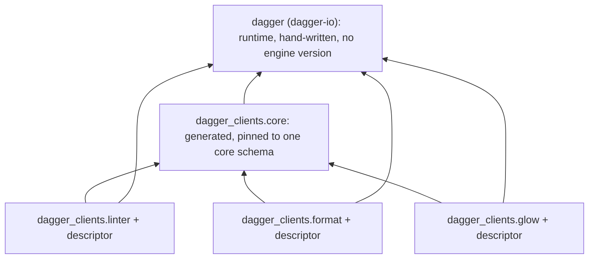
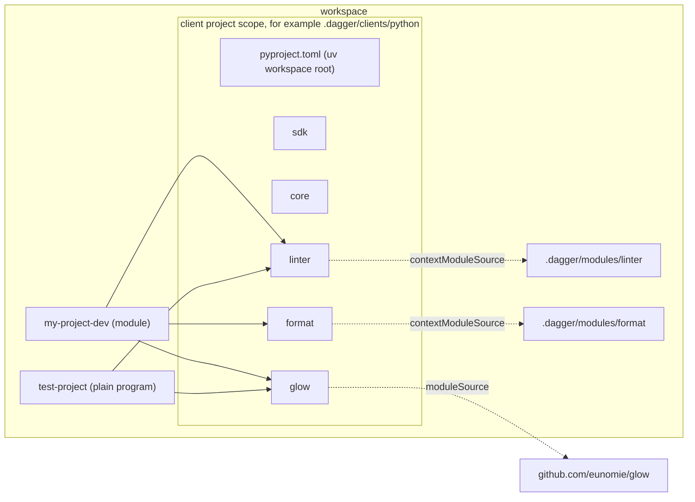
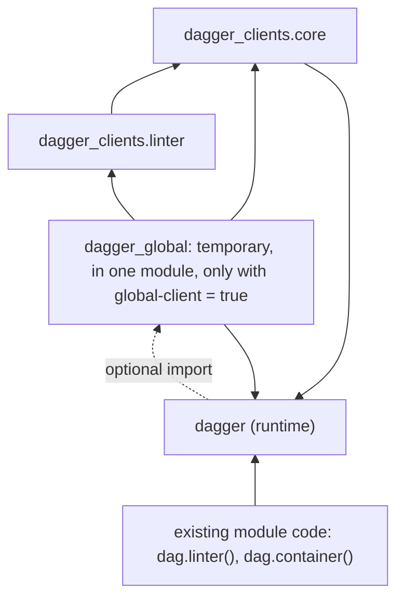

# Unified clients for the Python SDK

Status: design agreed; spikes open (revision 6)
Date: 2026-09-15
Repo base: `290ed4c`
Spec: "Unified clients" (language-neutral). Prior art: `dagger/java-sdk#23`.

This is the markdown copy of the HTML design page. Badges:
**[confident]** checked against code or by experiment.
**[decided]** Yves decided it.
**[provisional]** a detail that follows from a decision; change it freely during
implementation.
**[speculative]** not verified; a phase 1 spike must confirm it.

Revision 6, after Yves's answers. Every question is decided:

- Q12: a client project keeps its clients at the scope root. A module keeps them
  in `clients/` (section 4).
- Q14: a module gets no self client by default. The user declares one when the
  module calls itself.
- Q5: the flag is `[tool.dagger] global-client`; contributed fields are added at
  run time; the global client warns in phase 2.
- What is left is not a question but a measurement: the spikes in section 16 and
  the list in section 17.

Earlier revisions. 5: no `[project] dependencies` edits; self client; signature
rule. 4: `contextModuleSource`, no `[[dependencies]]`; runtime in `sdk/`; shared
default session. 3: a scope is one `pyproject.toml`, a uv workspace root. 2: the
location is a convention; a temporary global client.

## 1. Summary

- A scope is one `pyproject.toml`. It is a uv workspace root.
- Each client is a workspace member inside the scope. Core is a member. The
  runtime copy is the member `sdk/`.
- A client project keeps its clients at the scope root: `<scope>/linter`. A
  module keeps them in `clients/`: `<module>/clients/linter`.
- The SDK writes where each client is: the members and `[tool.uv.sources]`. The
  user writes which clients a project uses: `[project] dependencies`. The SDK
  never edits that list, except for the global client.
- A consumer that names one client installs that client, core and the runtime.
  It does not install the other clients.
- A member carries no path. Its files are the same in every scope.
- The scope can be anywhere. `.dagger/clients/python` is a suggestion for a
  client project. A module scope is the module directory.
- All generated code lives in the namespace package `dagger_clients`. The
  runtime keeps the name `dagger`.
- The way into a client is a function in its own package: `linter()`, `core()`.
  The session argument is optional.
- There is one default session per process. The runtime starts it on the first
  query. All clients share it.
- Each client package carries its descriptor and serves its module on first
  use. A git client uses `moduleSource`. A local client uses
  `contextModuleSource`. No `[[dependencies]]`.
- A module calls itself through a client to itself. The user declares that
  client; the SDK does not add one.
- An exported signature names core types and the module's own types only. A
  client type is for calls inside a function body.
- A temporary global client keeps existing module code working. A flag in the
  module's `pyproject.toml` turns it on. A new module has no flag.
- The runtime imports generated core in many places today. Phase 1 removes
  these imports.
- Local clients need an engine with `contextModuleSource`. Git clients work on
  today's engines.

## 2. Terms

The spec terms apply without change: client, scope, consumer, core, runtime,
serve. Added terms:

| Term | Meaning here |
| --- | --- |
| Scope `pyproject.toml` | The file that defines a scope for this SDK. It is a uv workspace root. It lists the members and their sources. |
| Member | A uv workspace member: a directory with its own `pyproject.toml` inside the scope. Each client, core, the runtime copy and the global client are members. |
| Client root | The directory in a scope that holds the client members. In a client project it is the scope root. In a module it is `clients/`. |
| Client project | A scope without a module. Its `pyproject.toml` can hold only the workspace, or it can also be a program that uses its own members. |
| Self client | A client to the module that holds it. The module uses it to call its own functions through the engine. |
| Distribution | What a package manager installs, for example `dagger-clients-linter`. |
| Import package | What Python code imports, for example `dagger_clients.linter`. |
| Namespace package | An import package without `__init__.py` (PEP 420). Many distributions can each add one sub-package to it. |
| Client package | The import package inside a client member: `dagger_clients.<name>`. |
| Descriptor | The data that tells a client package where its module is: a workspace path, or a git ref and pin. |
| Default session | The one session per process that a client uses when the caller passes none: `dagger.dag`. |
| Global client | A temporary generated object, `dag`, with one method per core field and per client. It exists only for migration. |

## 3. What exists today [confident]

The current SDK generates per scope. Each module gets its own copy of everything.

- `mod.dang:138` (`vendoredDir`) copies the whole `dagger-io` library into `<module>/sdk/`.
- `mod.dang:192` (`bindings`) generates one file, `sdk/src/dagger/client/gen.py`.
  It holds core and every client of the module. The input is the module-facing
  schema, `introspectionSchemaJSON`.
- The generator emits `class Client(Query)` and `dag = Client()`
  (`sdk/codegen/src/codegen/generator.py:245-257`).
- Module code reaches a client through core: `dag.client_dep()`.
- `python-sdk.dang:145-147` writes each client as `[[dependencies]]`. The engine
  serves the client. Generated code serves nothing.
- `python-sdk.dang:100-105` refuses clients in a scope without a module.
- `findClientRoot` exists (`python-sdk.dang:42`), with `pyproject.toml` as the marker.
- A module's `pyproject.toml` names the vendored runtime:
  `dagger-io = { path = "sdk", editable = true }`
  (`templates/default/pyproject.toml.tmpl`). The runtime build installs it
  (`runtime/build.dang:167-189`).
- Python SDK settings live in `[tool.dagger]` of the module's `pyproject.toml`:
  `use-uv`, `base-image`. `helpers/pyproject/pyproject.go:60-87` reads and
  writes them. `runtime/build.dang:304-313` reads them.
- `sdk/src/dagger/__init__.py:12-13` already has a hook for extra generated
  bindings: `from dagger_gen import *`.
- `SharedConnection` (`sdk/src/dagger/client/_session.py:208`) is a process
  singleton. It connects on the first query from `DAGGER_SESSION_PORT` and
  `DAGGER_SESSION_TOKEN`. A module and `dagger run` set these. Without them, a
  plain program must use `async with dagger.connection()`
  (`provisioning/_connection.py:73`).
- The runtime resolves a signature's types in `describe_type`
  (`sdk/src/dagger/mod/_describe.py:125`).
- The engine has an experimental `SELF_CALLS` module feature
  (`ModuleSourceExperimentalFeature`, `sdk/src/dagger/client/gen.py:193`).
- The committed core bindings (engine `v1.0.0-beta.10`) have
  `ModuleSource.clientSchemaIntrospectionJSON`, `ModuleSource.withName`,
  `Query.moduleSource(refString, refPin)`, `Module.serve(includeDependencies, entrypoint)`,
  `SourceMap.module`. `Query.contextModuleSource` does not exist.
- The generator already parses schema directives (`sdk/codegen/src/codegen/ast.py:93`).

## 4. Target layout

An arrow means "imports". The runtime imports no generated code. Section 9 adds
one optional, temporary exception.



The worked example. One client project holds the clients. Two consumers each
name the clients they use. Nothing is generated twice.



Two kinds of scope on disk [decided]:

```
.dagger/clients/python/               a client project (suggested location)
  pyproject.toml                      uv workspace root; no [project] table
  sdk/                                member: dagger-io, the runtime copy
  core/                               member: dagger-clients-core
  format/                             member: dagger-clients-format
  glow/                               member: dagger-clients-glow
  linter/                             member: dagger-clients-linter

.dagger/modules/my-module/            a module scope that declares its own clients
  pyproject.toml                      the module project AND the uv workspace root
  dagger-module.toml                  no [[dependencies]]
  src/my_module/
  sdk/
  clients/core/
  clients/linter/
  clients/my-module/                  a self client, only if the user declares one (7.3)
  global-client/                      only with global-client = true (section 9)
```

The client root differs because the two scopes differ. A client project holds
clients and little else, so the clients sit at its root, and the path reads
`.dagger/clients/python/linter`. A module holds the user's own source, so its
clients go one level down.

## 5. Packaging and scopes

### 5.1 What a member is [confident]

A directory with `pyproject.toml` and `src/`, built with `uv_build`. It builds
into a wheel without an engine.

```toml
# linter/pyproject.toml (generated)
[project]
name = "dagger-clients-linter"
version = "0.0.0"
dependencies = ["dagger-io", "dagger-clients-core"]

[build-system]
requires = ["uv_build>=0.8.4,<0.12.0"]
build-backend = "uv_build"

[tool.uv.build-backend]
module-name = "dagger_clients.linter"

[tool.dagger]
generated = "client"
```

```
linter/src/dagger_clients/            no __init__.py: a namespace package
  linter/__init__.py                  generated types, linter(), as_linter()
  linter/_target.py                   descriptor and the core digest it was generated against
  linter/py.typed
```

Every generated member has `[tool.dagger] generated`: `"client"`, `"core"`,
`"runtime"` or `"global-client"`. The SDK uses this marker to find its members.
A member has no `[tool.uv.sources]` and no path. Its files do not depend on the
scope that holds it, or on the client root. One member generated in two scopes
had equal digests.

The runtime member, `sdk/` [decided]: it holds only the hand-written runtime,
distribution `dagger-io`, as today's vendored `sdk/` without `gen.py`. It is not
a client. Phase 2 publishes the runtime and removes the member.

### 5.2 The scope `pyproject.toml` [decided]

The scope `pyproject.toml` has three parts. Each part has one owner.

| Part | What it says | Owner |
| --- | --- | --- |
| `[tool.uv.workspace] members` | Which directories are members. | The SDK |
| `[tool.uv.sources]` | Where each client declared on this scope is. It installs nothing. It makes nothing importable. | The SDK |
| `[project] dependencies` | Which clients this project uses. Only these are installed and importable. | The user |

Why the user owns `dependencies`: Dagger lets a user init a module and declare a
client. Dagger has no command that says "this module uses this client". So the
user says it in `pyproject.toml`, and the SDK does not guess.

Sources list the clients declared on this scope. They do not list every client
of the Dagger workspace: a consumer uses one scope per environment (5.3).

```toml
# .dagger/clients/python/pyproject.toml (a client project)
[tool.uv.workspace]
members = ["sdk", "core", "format", "glow", "linter"]

[tool.uv.sources]
dagger-io             = { workspace = true }
dagger-clients-core   = { workspace = true }
dagger-clients-format = { workspace = true }
dagger-clients-glow   = { workspace = true }
dagger-clients-linter = { workspace = true }
```

```toml
# .dagger/modules/my-module/pyproject.toml (a module scope)
[project]
name = "my-module"
dependencies = [
    "dagger-io",
    "dagger-clients-linter",          # added by the user, to use the linter client
]

[tool.uv.workspace]
members = ["sdk", "clients/core", "clients/linter", "clients/my-module"]

[tool.uv.sources]
dagger-io                = { workspace = true }
dagger-clients-core      = { workspace = true }
dagger-clients-linter    = { workspace = true }
dagger-clients-my-module = { workspace = true }   # declared, not used yet
```

Tested with uv 0.12.13 [confident]:

- A scope `pyproject.toml` without a `[project]` table works.
- A scope `pyproject.toml` with a `[project]` table can use its own members.
  With sources for three members and a dependency on one, uv installs only that
  member and core.
- `uv sync --locked --no-dev` works on that layout. The runtime build uses that form.
- Removing a member, its source and its directory, then `uv lock`, removes the
  client cleanly.
- Two editable members share the `dagger_clients` namespace. mypy and pyright
  see types across it when each member has `py.typed`.

### 5.3 How a consumer names a client [confident]

Inside the scope: the source already exists. The user adds the client to
`[project] dependencies`. The SDK never does.

Outside the scope: the user names the member by path. uv finds the member's
workspace and takes core and the runtime from it.

```toml
# test-project/pyproject.toml
[project]
dependencies = ["dagger-clients-linter", "dagger-clients-glow"]

[tool.uv.sources]
dagger-clients-linter = { path = "../.dagger/clients/python/linter", editable = true }
dagger-clients-glow   = { path = "../.dagger/clients/python/glow",   editable = true }
```

One scope per environment: a consumer that names members of two scopes gets two
`dagger-clients-core` sources. uv refuses: "Requirements contain conflicting
URLs for package `dagger-clients-core`". The failure is loud.

pip ignores uv sources and workspaces. A pip user installs the members by path,
core and the runtime included. The `CORE_DIGEST` import check is the guard for pip.

### 5.4 Where scopes go [decided: convention only]

- A scope can be anywhere. `.dagger/clients/python` is a suggestion for a client
  project. Nothing requires it.
- A module scope is the module directory. Its clients travel with the module,
  also in a git repository.
- Nothing at run time depends on the location. The descriptor names the module,
  not the member.
- Moving a whole scope changes only the path a consumer outside the scope names.
- Moving core inside the scope changes only the `members` list. Core cannot
  leave the scope.

### 5.5 Where the build gets it

- Plain program: uv reads the scope.
- Module that declares its own clients: the members are inside the module
  directory, so they are in the module's context directory. [speculative] The
  runtime build (`runtime/build.dang:167-189`) must accept a workspace module,
  in uv and pip modes.
- Module that uses a client project outside its directory [decided]: add the
  client project to the module's `include`, if a spike shows an include can name
  a path above the module root. Else refuse, and tell the user to declare the
  clients on the module scope.

## 6. Namespacing [decided]

Generated code goes into the top-level namespace package `dagger_clients`. A
client `telemetry` becomes `dagger_clients.telemetry` and cannot collide with
`dagger.telemetry`. A self client cannot collide with the module's own code: the
module is `my_module`, its self client is `dagger_clients.my_module`. Core is
`dagger_clients.core`, so a client named `core` is refused.

| Input | Rule | Example |
| --- | --- | --- |
| Client name | Lowercase. Replace `-` and `.` with `_`. | `my-project-dev` → `my_project_dev` |
| Refused | Not an identifier, a keyword, starts with `_`, equal to `core`, `sdk` or `global-client` (the SDK's own member directories), two clients with the same result. | `class`, `core`, `sdk` |
| Distribution | `dagger-clients-` + name with `-` | `dagger-clients-my-project-dev` |
| Member directory | Client root + name with `-`. Client project: `<name>`. Module: `clients/<name>`. | `linter`, `clients/linter` |
| Root class | Today's codegen rule | `MyProjectDev` |
| Entry function | Snake-case name | `my_project_dev()` |

[provisional] A client project can also be a program with its own directories.
So `generateScope` refuses to write a member over a directory that exists and
has no `[tool.dagger] generated` marker. The message names the directory and the
client. Nothing is written.

## 7. Entry point

### 7.1 The entry function [provisional]

```python
# A module (consumer)
from dagger import function, object_type
from dagger_clients.core import Directory
from dagger_clients.linter import linter

@object_type
class MyProjectDev:
    @function
    async def lint(self, src: Directory) -> str:
        return await linter().lint(src)
```

```python
# A plain program (consumer), with the default session started on first query
import anyio
from dagger_clients.core import core
from dagger_clients.linter import linter

async def main():
    src = core().host().directory(".")
    print(await linter().lint(src))

anyio.run(main)
```

Constructor arguments follow today's rules: required are positional, optional
are keyword-only. The session is an optional keyword-only argument [decided];
without it the function uses the default session (8.1). A GraphQL argument named
`session` becomes `session_`.

```python
def linter(source: Directory, *, config: str | None = None,
           session: Session | None = None) -> Linter: ...
```

### 7.2 Fields a client contributes to core types [decided]

A field a client contributes to a core type becomes a module-level function
with the core receiver first. The receiver holds its session.

```python
from dagger_clients.linter import as_linter

lint = as_linter(binding)          # was: binding.as_linter()
```

Two core types that contribute a field with one name get one function with
`@typing.overload` per receiver type.

### 7.3 A module calling itself [decided]

A module calls one of its own functions through a client to itself. There is no
special mechanism. A self client is a client like any other, and the SDK does
not create one on its own.

1. The user declares a client to the module on the module scope.
2. `dagger generate` writes `clients/my-module` and its source.
3. The user adds `dagger-clients-my-module` to `[project] dependencies`.
4. The module code imports the self client and calls it.

```python
from dagger import function, object_type
from dagger_clients.my_module import my_module

@object_type
class MyModule:
    @function
    async def build(self) -> str: ...

    @function
    async def release(self) -> str:
        return await my_module().build()     # a call through the engine
```

- Serve: the descriptor is the module's own path. In the module's session,
  `contextModuleSource(path).withName("my-module").asModule.serve` serves the
  module into its own session. [speculative] The engine accepts this. The spike
  also checks whether it needs the experimental `SELF_CALLS` feature.
- Generation order: the self client comes from the module's schema. The engine
  reads that schema by running the module. So the module runs with the previous
  self client while the SDK generates the next one. Two rules keep this from
  blocking:
  - The step order above puts the dependency after the first generation. So the
    build never installs a self client that does not exist yet.
  - While the runtime registers the module's types, a core digest mismatch is a
    warning, not an error (section 10).

  [speculative] A spike must confirm that regeneration with a self client does
  not block.

### 7.4 What an exported signature can name [decided]

This is an engine rule. A module's exported functions, fields and constructor
arguments can name two kinds of types only: core types, for example
`Directory`, and the module's own types. So module A cannot expose a function
that returns a type of module B. A client type is for calls inside a function
body.

- The runtime refuses a client type in a signature when it registers types. The
  check is in `describe_type` (`sdk/src/dagger/mod/_describe.py:125`): a class
  from `dagger_clients.<name>`, other than `dagger_clients.core`, is refused.
  The message names the function and the type.
- [provisional] The classes of a self client are refused the same way. A
  signature uses the module's own classes.

```python
@function
def lint(self) -> Linter: ...          # refused: "lint returns dagger_clients.linter.Linter,
                                        #  a type of another module; return a core type
                                        #  or a type of this module"
```

## 8. Session and serve

### 8.1 The default session [decided]

The session is not required. Most code never names one.

- A client called without `session=` uses the default session, `dagger.dag`.
- There is one default session per process. All clients share it. So every call
  on a client, and on every other client, uses the same session.
- The runtime starts the default session on the first query. In a module and
  under `dagger run`, `SharedConnection` already does this today.
- In a plain `python main.py`, the runtime also provisions the engine on the
  first query, and closes it at exit. Today this program needs
  `async with dagger.connection()`. [speculative] Clean close at exit needs a spike.
- A caller passes `session=` only to use a specific session, for example one
  from `dagger.Connection()`.

Why not one session per client:

| Reason | Detail |
| --- | --- |
| Objects cross clients | `linter().lint(src)` passes a `Directory` that core made. An object belongs to one session. Host directories, secrets and served modules do not exist in another session. |
| A module has one session | The engine gives a module one session for a function call. The function returns its result through that session. The module cannot open another one. |
| Cost | In a plain program, each session is a separate engine connection. |

The shared default session gives the same experience as a session per client:
nobody manages a session, and calls on a client share one. The serve memo is per
session and per client, so each client still serves its module once.

### 8.2 What `dagger.dag` is [confident on shape]

Without the global client, `dagger.dag` is an instance of hand-written
`dagger.Session`. The session owns the connection, the query transport and the
serve memo. It has no API fields.

- The new `Session` wraps today's `SharedConnection`.
- `dagger.connection()` and `dagger.Connection` yield a `Session`.
- Without the global client, `Session.__getattr__` raises `AttributeError` with
  a migration message that names `core().container()` and the `global-client`
  flag. The runtime does not import core for this.
- Without the global client, a PEP 562 `__getattr__` on `dagger` does the same
  for `dagger.Container` and other core names.

### 8.3 How serve happens [provisional]

Serve is async and `linter()` is sync, so serve runs at execute time.

1. The runtime `Context` gets the set of descriptors the query needs.
2. `linter()` creates a `Context` that needs the linter descriptor.
3. Chained selections keep the set.
4. `Context.execute` asks the session to serve each descriptor first.
5. The session serves each descriptor at most once, with one `anyio.Lock` per entry.
6. An object passed as an argument becomes an ID through its own `execute`,
   which serves its own descriptor.
7. The module runtime loads arguments from IDs in `dagger/mod/_converter.py:62`.
   The generated class carries its descriptor for this.

```python
# dagger_clients/linter/_target.py (generated)
from dagger.client import Target

TARGET = Target.local(name="linter", path="/.dagger/modules/linter")
# or: Target.git(name="glow", ref="github.com/eunomie/glow", pin="4f1c9e…")
CORE_DIGEST = "sha256:…"
```

The runtime owns the `Target` class and the serve query. The serve query uses
the raw query builder. One query shape serves both session kinds:

| Descriptor | Serve query, client session and module session |
| --- | --- |
| git | `moduleSource(refString, refPin).withName(name).asModule.serve` |
| local | `contextModuleSource(path).withName(name).asModule.serve` |

## 9. Temporary global client [decided]

### The goal

Existing module code must keep working without a change to the user's code.
That code uses `dag.linter().lint()`, `dag.container()` and `dagger.Container`.
A global client gives it these names during migration. A newly initialized
module does not get the global client.

### The flag

```toml
# <module>/pyproject.toml
[tool.dagger]
global-client = true
```

- The flag is in the same table as `use-uv` and `base-image`.
- No flag means no global client.
- Existing module: `generateScope` writes `global-client = true` once, when it
  upgrades a module to the new layout. It detects an existing module: the
  module had a config before generation (`python-sdk.dang:108`) and has legacy
  bindings at `sdk/src/dagger/client/gen.py`.
- New module: the templates do not contain the flag.
- After migration: `dagger call python-sdk mod config set --global-client=false`
  removes the flag. The next `dagger generate` removes the global client.
  `config get` reports the flag.
- Only generation reads the flag. The runtime does not read `pyproject.toml`.

### What the SDK generates

With the flag, `generateScope` writes the member `global-client/`: distribution
`dagger-global-client`, import package `dagger_global`. It is not a client. It
is the only generated code that belongs to one consumer, because it lists that
module's own clients.

The one place the SDK edits dependencies: with the flag, the SDK adds
`dagger-global-client` to `[project] dependencies`, and without the flag it
removes it. The existing code did not declare its use of clients, so the SDK
must install them for it. The member depends on every client of the module, so
they install with it. When the flag goes, those clients stay installed only if
the user added them to `dependencies`.

```python
# dagger_global/__init__.py (generated, temporary)
from dagger import Session
from dagger_clients.core import *                  # dagger.Container keeps working
from dagger_clients.core import core
from dagger_clients.linter import Linter, linter   # and every type of each client

class Client(Session):
    def container(self, *, platform=None) -> Container:
        return core(session=self).container(platform=platform)

    def linter(self, source: Directory) -> Linter:
        return linter(source, session=self)

dag = Client()
```

- Same classes: `dag.container()` returns `dagger_clients.core.Container`. Old
  and new calls can mix in one module.
- Contributed fields: old code calls `binding.as_linter()`. The global client
  adds it to the core class at import, at run time only. Type checkers do not
  see it, which points to the migration.
- End of life: the global client raises a `DeprecationWarning` on import in
  phase 2. Its removal comes in a later release.
- Plain programs: not covered. This SDK generates no Python client for a plain
  program today (`python-sdk.dang:100-105`).

### How `dagger` finds it

The runtime keeps one optional import. It replaces today's `dagger_gen` hook
(`sdk/src/dagger/__init__.py:12-13`).

```python
# dagger/__init__.py (hand-written)
try:
    from dagger_global import *     # temporary global client, only with the flag
except ModuleNotFoundError:
    from dagger.client._session import dag
```



- This is the only place the runtime names generated code. It is a known
  exception to rule 3. It is off for new modules. It goes away with the global
  client.
- The import is static, so mypy and pyright can type `dag` as `Client` when
  `dagger_global` exists. [speculative] Check 11 must confirm it.

## 10. Type checking and staleness [decided]

| When | Signal | Needs the engine |
| --- | --- | --- |
| Type check | `py.typed` and full annotations. A removed or changed function is a type error after `dagger generate`. | No |
| Install (uv) | Members from two scopes in one environment fail with a conflict on `dagger-clients-core`. | No |
| Import | The client passes its `CORE_DIGEST` and the installed core's digest to a runtime function. A mismatch raises `dagger.StaleClientError` (an `ImportError`) with "run `dagger generate`". While the runtime registers a module's types, it logs a warning instead, so a module with a self client can regenerate (7.3). The runtime receives two strings, so it does not import core. | No |
| Serve and query | A failed serve raises `dagger.ClientServeError`. A "cannot query field" error on a query that needs a descriptor becomes `StaleClientError`. An engine/core mismatch is a warning in phase 1. | Yes |

A CI check that runs `dagger generate` and asserts no diff catches the rest.

## 11. Artifact graph rules in Python

| Rule | Python meaning | Check |
| --- | --- | --- |
| Core names no client | `dagger_clients/core/` imports no other `dagger_clients` package. | AST scan; generate core with two client sets and compare digests. |
| No client names another | A client imports only `dagger`, `dagger_clients.core`, itself. The global client is not a client package. | AST scan. |
| Runtime depends on nothing generated | No `dagger/` module imports `dagger_clients`, `dagger.client.gen`, `dagger_gen`. One exception: the optional `dagger_global` import. | Import every runtime module without `dagger_clients` and `dagger_global`; AST scan with the one exception. |

Where the runtime depends on generated core today [confident]. `dagger/telemetry.py`
is clean; the trap is elsewhere:

| Location | Dependency | Fix |
| --- | --- | --- |
| `sdk/src/dagger/__init__.py:10-16` | Star-imports `dagger_gen` or `dagger.client.gen`. | Replace with the optional `dagger_global` import; add PEP 562 message. |
| `sdk/src/dagger/client/_core.py:24`, `client/_session.py:11` | `from dagger import …` runs `dagger/__init__.py`, which loads core. The Python-specific trap. | Import from `dagger._exceptions`, `dagger.telemetry`. |
| `sdk/src/dagger/mod/_module.py:19-20, 1054-1137`, `_converter.py:7-8, 165-180`, `_exceptions.py:14-15, 143-147`, `_describe.py:16, 32`, `_entrypoint.py:11, 34` | Type registration through generated `dag`, `TypeDef`, `TypeDefKind`, `FunctionCachePolicy`, `JSON`. | [decided] Raw query builder. |
| `sdk/src/dagger/provisioning/_connection.py:82-83, 97-98`, `_engine.py:12, 31` | Imports `dag`, `Client`. | Return a `Session`. |
| `sdk/src/dagger/_engine/_version.py:3` | Generated `CLI_VERSION` in the runtime, used to download a CLI. | Keep in runtime; revisit when the runtime is published. |
| `sdk/codegen/src/codegen/generator.py:245-257` | Emits `Client`, `dag`. | Emit `core()`; emit `Client` and `dag` only into `dagger_global`. |
| `sdk/src/dagger/client/_guards.py:44` | Text names `dagger.client.gen`. | Take the name from the caller. |

## 12. generateScope and findClientRoot

**`generateScope` (`python-sdk.dang:99`) [provisional].** The scope directory
(`ws.cwd`) is the workspace root. The client root is the scope root when
`isModule` is false, and `clients/` when it is true. Everything else is the same
for both kinds.

1. Scope file: read the scope `pyproject.toml`. A scope without one gets a new
   file with only `[tool.uv.workspace]` and `[tool.uv.sources]`.
2. Runtime: write `sdk/` with the hand-written runtime only. In an existing
   module, this replaces the vendored `sdk/` and its `gen.py`.
3. Core: generate once from the client-facing schema into the client root.
   [speculative] How to get core alone.
4. Clients: for each client, read `clientSchemaIntrospectionJSON`, partition by
   `@sourceMap`, write the descriptor (`kind`, and the workspace path or
   `asString` and `pin`), write the member in the client root. A self client
   takes the same path.
5. Collisions: refuse to write a member over a directory that exists and has no
   `[tool.dagger] generated` marker.
6. Removed clients: delete each directory in the client root that has
   `[tool.dagger] generated = "client"` and whose client is no longer declared.
7. SDK-owned entries: set the `members` entries of generated members and one
   `{ workspace = true }` source per member. Keep all other content, including
   members the user added. [provisional] This needs a TOML editor that keeps
   formatting; `helpers/pyproject` reformats the file today.
8. `[project] dependencies`: do not edit it. The one exception is
   `dagger-global-client`, added with the flag and removed without it.
9. Module scope:
   - replace the old `dagger-io = { path = "sdk", editable = true }` source;
   - remove every `[[dependencies]]` entry from `dagger-module.toml`; the
     manifest builder already has `withoutLegacyRuntimeDependencies`
     (`python-sdk.dang:145`);
   - global client: write the flag for an existing module without it; with the
     flag, write `global-client/`; without it, remove it.
10. Scope without a module: remove the refusal at `python-sdk.dang:100-105`.
11. Lock: refresh `uv.lock` if it exists.

Each scope writes only inside its own directory. With no `[[dependencies]]`, the
static entrypoint refusal for clients at `python-sdk.dang:154-156` goes away.

**`findClientRoot` (`python-sdk.dang:42`) [provisional].** The marker stays
`pyproject.toml`. A `pyproject.toml` with `[tool.dagger] generated` belongs to a
generated member. It is never a client root. The answer is the nearest
`pyproject.toml` above it: the scope root. Today's `sdk/` lift stays for modules
that are not upgraded yet. This repo's own `sdk/` has no marker, so the check at
`.dagger/modules/e2e/main.dang:119` still holds.

## 13. Engine dependency [decided]

The design builds on `Query.contextModuleSource(path)`. It assumes the engine
will ship the field (`dagger/dagger#14148`). It does not use `[[dependencies]]`.
It does not use `currentWorkspace`.

| Descriptor | Works on |
| --- | --- |
| git | Today's engines, in client sessions and module sessions. |
| local | An engine with `contextModuleSource`, in client sessions and module sessions. |

- Implementation can start now. Git clients can be tested end to end now.
- Local-client end-to-end checks need an e2e engine with the field.
  `.dagger/modules/engine-e2e` builds `v1.0.0-beta.13` today. It must move to an
  engine that has the field.
- Engine rule: an exported signature names core types and the module's own types
  only (7.4). Nothing in this design needs more.
- [speculative] The descriptor path is relative to the workspace root. In a
  module session, the engine resolves it against the module's context root. For
  a module in the user's workspace, the two roots must be the same directory.
- [speculative] A module can serve itself into its own session (7.3).

## 14. Decisions

Every question in this document is decided.

| Question | Decision |
| --- | --- |
| Q1. Namespace name | `dagger_clients`. |
| Q2. Where the runtime comes from | A runtime copy in each scope, not published: the member `sdk/`, without generated code. Not a client, so not in the client root. The global client follows the same rule: `global-client/`. |
| Q3. The session | An optional keyword-only `session=`. One default session per process, started on the first query and shared by every client. In a plain program, the runtime provisions the engine on the first query. |
| Q4. Contributed field shape | Module-level function: `as_linter(binding)`. |
| Q5. The global client | Flag `[tool.dagger] global-client = true`. Contributed fields are added to the core class at run time. A `DeprecationWarning` on import in phase 2; removal in a later release. |
| Q6. `dagger.mod` and core | Rewrite the module runtime protocol on the raw query builder. |
| Q7. Local clients in modules | Build on `contextModuleSource`. No `[[dependencies]]`. |
| Q8. A module that uses a client project outside its directory | `include` the client project, if a spike confirms it. Else refuse, and tell the user to declare the clients on the module scope. |
| Q9. Who adds a client to `[project] dependencies` | The user, in every scope. The SDK writes sources for every client declared on the scope, including a self client. Exception: the global client (section 9). |
| Q10. Removing a client | `generateScope` deletes the member, its source and its `members` entry, then relocks. |
| Q11. Version check strictness | Client/core mismatch: import error, and a warning while the runtime registers types. Engine/core mismatch: warning in phase 1. |
| Q12. The client root inside a scope | The scope root in a client project. `clients/` in a module. |
| Q13. Client types in a module's own signatures | Not supported. An exported signature names core types and the module's own types only. The runtime refuses a client type with a clear message (7.4). |
| Q14. A self client for every module | No. The user declares a client to the module when the module calls itself. |

## 15. Checks

Invert each assertion once and confirm that it fails.

1. The digest of the `linter` member is the same in a module scope and in a client project scope.
2. Every `dagger.*` module imports in a venv without `dagger_clients` and without `dagger_global`.
3. AST scan of imports in core, in each client package and in the runtime.
4. Module source that calls a client passes mypy and pyright, then `dagger call` runs it.
5. `uv build --wheel` for each member with no engine; the wheel exists and contains the package; it imports in a fresh venv.
6. A changed `CORE_DIGEST` makes a client import raise `StaleClientError`; during type registration it logs a warning.
7. Fake engine: two calls on one client send one serve; two sessions send two.
8. Shared session: `linter().lint(core().directory())` works in the default session.
9. A module with a git client and a local client loads both through the CLI. The local half needs an engine with `contextModuleSource`.
10. No `[[dependencies]]`: generating a module that has them removes them; the module still calls its clients.
11. Global client, existing module: generation writes `global-client = true` and adds `dagger-global-client` to `dependencies`; the unchanged source passes mypy and runs through `dagger call`; `type(dag.container()) is dagger_clients.core.Container`.
12. Global client, new module: no `global-client` key, no `global-client/`; `dag.container` raises the migration message.
13. Global client, turned off: `config set --global-client=false`, then generate; `global-client/` and its dependency are gone.
14. Any location: a client project in another path; checks 1, 4 and 9 pass; `findClientRoot` inside a member answers with the scope root.
15. Install one: a consumer that names one member gets only that member, core and the runtime.
16. One scope per environment: a consumer that names members of two scopes fails with uv's conflict on `dagger-clients-core`.
17. Remove a client: its member, source and `members` entry are gone; `uv sync --locked` passes.
18. User content kept: user tables, comments and a user member in the scope `pyproject.toml` survive generation byte for byte.
19. Dependencies untouched: without the flag, generation leaves `[project] dependencies` byte for byte, also when it adds or removes clients.
20. Default session in a plain program: `python main.py`, without `dagger.connection()` and without `dagger run`, runs a client call and exits cleanly.
21. Self client: a module with a client to itself calls one of its own functions through `dagger call`; after an API change, `dagger generate` succeeds and the self client has the new API.
22. Signature rule: a function that returns `dagger_clients.linter.Linter` fails registration with a message that names the function and the type; a function that returns a core type or the module's own class passes.
23. Collision: a client whose name matches a user directory in the client root is refused; nothing is written.

## 16. Phases

**Phase 1: self-serving clients in workspace scopes.**

- Spikes first: a module serves itself, with and without `SELF_CALLS`, and
  regenerates with a self client; core-alone schema; a workspace module in
  `runtime/build.dang` (uv and pip modes); a format-keeping TOML editor; the
  `include` of a client project above the module root; typing through
  `dagger_global`; default session start and close in a plain program.
- Remove every runtime import of generated core.
- Runtime: `Session` and the default session, `Target`, serve memo, the core
  digest check, error types, the signature rule in `describe_type`.
- Generator: partition by `@sourceMap`; the core member, one member per client,
  entry functions, descriptors, digests, `global-client/` with the flag.
- `generateScope` turns every scope into a uv workspace root, writes `sdk/`,
  manages the members and sources, and removes `[[dependencies]]`. It does not
  edit `[project] dependencies`, except for the global client. New modules use
  the new layout. Existing modules get `global-client = true`.
- `findClientRoot` lifts a member to its scope. `mod config` handles `global-client`.
- Serve: git clients through `moduleSource`, local clients through `contextModuleSource`.
- Checks 1–23. Local-client checks run once the e2e engine has `contextModuleSource`.

**Phase 2: published runtime, end of migration.** Publish the runtime and remove
the `sdk/` member. The global client warns on import; its removal date is
Yves's call.

## 17. Not verified

- [speculative] A module can serve itself into its own session, and whether
  that needs `SELF_CALLS`.
- [speculative] Regeneration of a module with a self client does not block.
- [speculative] For a module in the user's workspace, the context root that
  `contextModuleSource` uses is the workspace root.
- [speculative] How `generateScope` gets core alone. Fallback: strip module-owned
  types from a client schema, with Java's skew guard.
- [speculative] `beta.13` introspection carries `@sourceMap(module:)`.
- [speculative] The runtime build installs a module that is a uv workspace root,
  in uv and pip modes (`runtime/build.dang:167-189`).
- [speculative] A scope inside a tree that already has a uv workspace root above it.
- [speculative] A consumer outside the scope that is itself a uv workspace root.
- [speculative] A module `include` can name a path above the module root.
- [speculative] mypy and pyright type `dagger.dag` as the global `Client`
  through the optional import.
- [speculative] The default session provisions the engine on first query and
  closes it cleanly at exit.
- [speculative] `Module.serve` from a module session on this repo's engine.
- [speculative] Spec decision 4: a client function whose signature names a type
  from another client.

Verified by experiment with uv 0.12.13, on hand-written stand-ins for generated
members: namespace build; shared namespace across editable installs; mypy and
pyright errors across the namespace; a scope root with and without `[project]`;
a consumer inside and outside the scope installs only the member it names plus
core; `uv sync --locked --no-dev`; removal and relock; two scopes in one
environment fail on `dagger-clients-core`; one member's files are identical in
two scopes.
